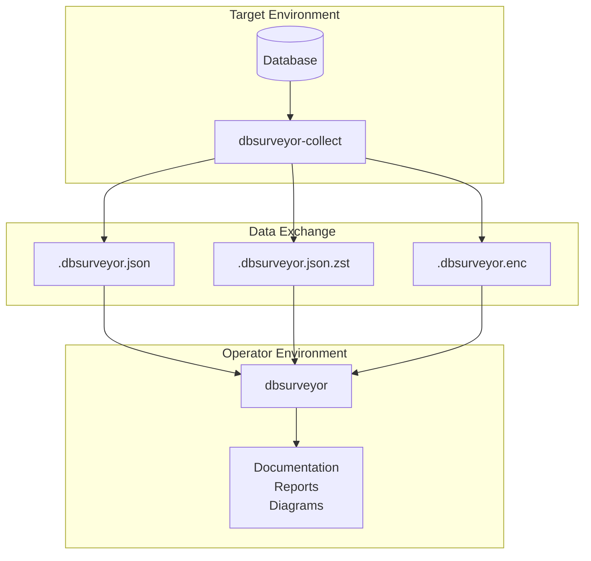
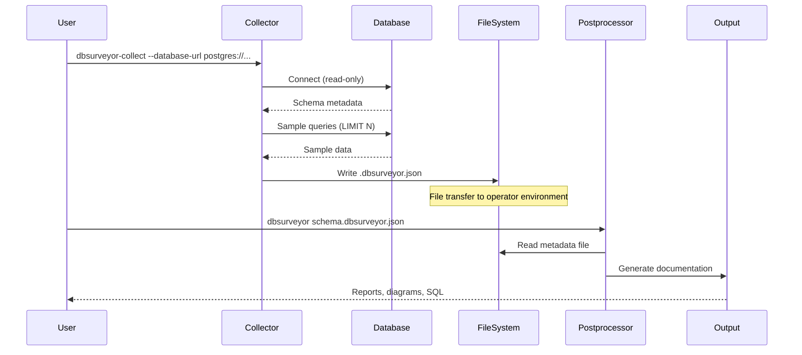

# System Architecture

## High-Level Architecture



## Dual-Binary Architecture

The system consists of two independent executables that communicate through structured file interchange:

### 1. Collector Binary (dbsurveyor-collect)

**Purpose**: Database metadata extraction and structured output generation

**Key Responsibilities**:

- Connects to target databases using read-only operations
- Extracts comprehensive metadata (tables, columns, constraints, indexes)
- Samples data using intelligent ordering strategies
- Generates validated JSON output with optional compression/encryption
- Operates with minimal network footprint (database connection only)

**Security Guarantees**:

- Never stores or logs database credentials
- All operations are strictly read-only
- Credential sanitization in all error messages and logs
- No external network calls except to target database

### 2. Postprocessor Binary (dbsurveyor)

**Purpose**: Offline documentation generation and analysis

**Key Responsibilities**:

- Processes collected metadata files completely offline
- Generates comprehensive documentation (Markdown, HTML)
- Creates visual diagrams and relationship maps
- Applies configurable data redaction for privacy
- Reconstructs SQL DDL from metadata

**Security Guarantees**:

- Zero network connectivity required
- Operates in air-gapped environments
- Configurable redaction without modifying source data
- No telemetry or external reporting

## Data Flow Architecture



## Workspace Architecture

The system uses a multi-crate Rust workspace for clear separation of concerns:

```text
dbsurveyor/
├── dbsurveyor-core/          # Shared library
│   ├── src/
│   │   ├── models/           # Data structures
│   │   ├── adapters/         # Database adapter traits
│   │   ├── security/         # Encryption and credential handling
│   │   └── validation/       # JSON Schema validation
│   └── Cargo.toml
├── dbsurveyor-collect/       # Collector binary
│   ├── src/
│   │   ├── adapters/         # Database-specific implementations
│   │   ├── sampling/         # Data sampling strategies
│   │   └── output/           # File generation
│   └── Cargo.toml
├── dbsurveyor/               # Postprocessor binary
│   ├── src/
│   │   ├── processors/       # Metadata processing
│   │   ├── generators/       # Documentation generation
│   │   ├── templates/        # Askama templates
│   │   └── redaction/        # Privacy controls
│   └── Cargo.toml
└── Cargo.toml                # Workspace configuration
```

## Security Architecture Layers

### 1. Network Security

- **Minimal Attack Surface**: Only database connections allowed
- **No External Dependencies**: All processing happens locally
- **Connection Timeouts**: 30-second default timeouts prevent hanging
- **Read-Only Operations**: No data modification capabilities

### 2. Credential Security  

- **Never Stored**: Credentials parsed and immediately consumed
- **Memory Zeroing**: Sensitive data cleared from memory after use
- **Sanitized Logging**: Connection strings redacted in all outputs
- **Separate Configuration**: Credentials never in configuration files

### 3. Data Security

- **AES-GCM Encryption**: Industry-standard authenticated encryption
- **Random Nonces**: Unique nonce per encryption operation
- **Key Derivation**: Argon2id with configurable parameters
- **Integrity Protection**: Authentication tags prevent tampering

### 4. Output Security

- **Schema Validation**: All outputs validated against JSON Schema
- **No Credential Leakage**: Validation prevents credential inclusion
- **Configurable Redaction**: Privacy controls in postprocessor only
- **Format Versioning**: Backward compatibility and migration support

## Performance Architecture

### Connection Management

- **Connection Pooling**: Configurable pool sizes (5-10 connections default)
- **Retry Logic**: Exponential backoff with jitter for failed connections
- **Resource Limits**: Memory and connection limits prevent resource exhaustion
- **Graceful Degradation**: Partial collection on connection failures

### Query Optimization

- **Indexed Ordering**: Uses primary keys and indexes for efficient sampling
- **Batch Processing**: Configurable batch sizes for large schemas
- **Query Timeouts**: Prevents slow queries from blocking collection
- **Throttling**: Configurable delays between operations

### Memory Management

- **Streaming Processing**: Large datasets processed in chunks
- **Explicit Cleanup**: Large structures explicitly dropped
- **Memory Monitoring**: Benchmarks track memory usage patterns
- **Efficient Serialization**: Optimized JSON generation and compression

This architecture ensures security, performance, and maintainability while supporting the diverse requirements of database schema collection across multiple database engines.
