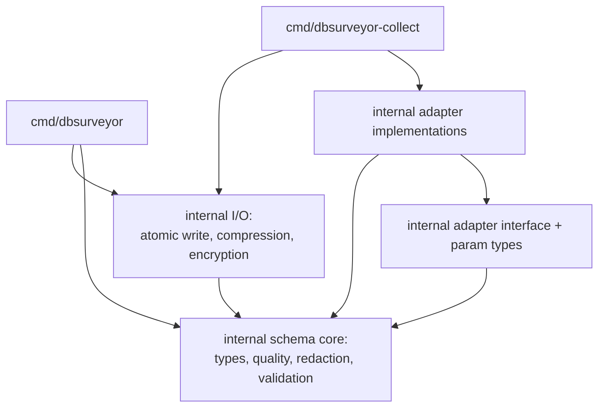

# Go Clean-Slate Rewrite: Repository and Package Structure

## Summary

Reimplement dbsurveyor in Go as a greenfield project at the repository root,
organized around a single core package that owns the schema type and every
operation over it, with database adapters behind an interface wired explicitly
at the command layer. The Rust workspace is archived rather than ported, and
the obligation to read artifacts the Rust implementation produced is dropped.

---

## Problem Frame

The case for leaving Rust is driver coverage. The Rust ecosystem has no
production-grade pure-Rust drivers for MSSQL, Oracle, or DB2, and supporting
them means hand-written FFI bindings to vendor C client libraries. That puts
unsafe code exactly where untrusted network data is parsed, which inverts the
security argument for choosing Rust in the first place. Go has pure-Go
wire-protocol drivers for every relevant target, and `go-ora` in particular
needs no Oracle Instant Client, which matters for airgapped installs.

The original port plan treated this as a migration: a `go/` subtree beside a
frozen Rust tree, golden fixtures generated by the Rust binaries as the
correctness arbiter, a parity harness diffing both implementations against the
same container, and a mechanical gate before cutover. That apparatus exists to
protect operators holding artifacts from a shipped version.

No such operators exist. The repository has no git tags and no GitHub
releases. dbsurveyor has never shipped a usable version, so the on-disk
formats were never offered to anyone as a contract. Every piece of the
two-tree migration machinery is protecting a promise that was never made, and
the cost of that machinery falls on a single maintainer who would be
maintaining two toolchains for the duration.

The second inherited assumption is structural. The port spec describes a Go
tree that mirrors the current three-crate workspace module-for-module. Much of
that Rust module tree exists for Rust-specific reasons: the 600-line
single-purpose-file convention and `pub(crate)` visibility control. Go's
package boundary is a visibility boundary and files inside a package are free,
so transliterating the taxonomy produces a `models` grab-bag package that
every other package imports, plus concerns split away from the type they all
operate on.

---

## Key Decisions

**Clean slate at the repository root.** The Go module is the repository root
from the first commit. This supersedes ADR 0001 decisions 1, 3, 5, and 6 --
the `go/` subtree, promote-at-cutover, paths-filtered CI, and the
`rust-security-fix` freeze label all exist to manage two live trees and have
nothing to manage once the Rust tree is archived.

**Parity is to the specification, not to the Rust implementation.** The Go
implementation is correct when it satisfies the spec, not when it reproduces
what the Rust code happened to compute. This removes byte-diff-against-Rust as
a gate and makes the Go test suite the arbiter.

**Drop v0.1.x artifact compatibility.** Nothing was released, so nothing needs
to be read. On-disk formats are specified fresh from the Go implementation.

**A single core package over the Rust module taxonomy.** Quality scoring,
redaction, and validation all operate on `DatabaseSchema`. Splitting them into
sibling packages is what forces a container-named types package that everything
imports. Keeping them with the type they act on removes that pressure and
shrinks the import graph.

**Explicit adapter wiring over an init()-based driver registry.** A
`database/sql`-style registry solves the factory import cycle, but blank-import
registration is a stdlib historical wart and Go style guidance discourages
`init()`. With six adapters known at compile time, the command layer can build
the map directly -- same cycle break, no global mutable state, easier to test.

**The first Go release is v0.1.0.** ADR 0001 chose v0.2.0 to sit above a frozen
v0.1.x line, but that line was never published. Starting at v0.1.0 makes the
first published version the first version, with `v0.1.0-alpha.N` pre-releases
during buildout. The stale v0.1.x references in project docs are rewritten
regardless (R4), so nothing is gained by working around them.

**The existing issue tree is closed and re-derived.** Issues #215 through #251
are closed as superseded rather than triaged item by item, and a fresh set is
generated from this document during planning. Roughly twenty of them describe
work that survives unchanged, so this trades some accurate per-issue detail for
a tracker with no stale structural assumptions in it -- the same trade the code
decision makes.

---

## Package Structure

Dependency direction, with the schema core as a leaf that adapters and
commands depend on but which depends on nothing internal:

The cycle in the original spec came from placing the adapter interface, its
parameter types, and the driver factory in one package: implementations must
import that package for the types, while the factory must import the
implementations to construct them. Splitting the interface into a leaf package
and moving construction to `cmd/` breaks it in both directions.

---

## Requirements

### Repository layout

- R1. The Go module is the repository root, with module path
  `github.com/EvilBit-Labs/dbsurveyor`.
- R2. The Rust workspace is removed from the default branch and preserved on a
  `rust-final` branch.
- R3. The database-behavior entries in [GOTCHAS.md](GOTCHAS.md) are carried
  forward and re-validated against the Go implementation as each adapter lands.
- R4. [AGENTS.md](AGENTS.md) is rewritten for the Go tree; its current
  description of a `bin/collector`, `bin/postprocessor`, `crates/shared` layout
  is already stale against the Rust tree.

### Package structure

- R5. Application packages live under `internal/`; only `cmd/` sits outside it,
  so no package becomes an API the project owes compatibility to.
- R6. A single core package owns `DatabaseSchema` and the operations over it:
  quality scoring, redaction, and validation.
- R7. No package is named for a container concept. `models`, `util`, `common`,
  and `output` are disallowed as package names; a package name names a concept.
- R8. Atomic writes, compression, encryption, and output-extension dispatch
  live in a package separate from the schema core.
- R9. `cmd/` packages hold flag parsing and wiring only. Collection and report
  orchestration live under `internal/`.

### Adapter layer

- R10. The adapter interface and its parameter types live in a leaf package
  that adapter implementations import.
- R11. Concrete adapters are constructed by explicit wiring at the command
  layer. No `init()`-based registration and no global registry.
- R12. All six adapters -- PostgreSQL, MySQL, SQLite, MongoDB, MSSQL, Oracle --
  are in scope from the first implementation phase.
- R13. No CGO anywhere in the dependency graph; `CGO_ENABLED=0` in build and
  CI, and no CGO-requiring dependency may enter `go.sum`.

### Formats and security

- R14. The Go implementation carries no obligation to read artifacts produced
  by the Rust implementation.
- R15. On-disk formats -- the JSON schema document, zstd framing, and the
  AES-GCM encrypted envelope -- are specified fresh, with the Go implementation
  as the reference and a written byte specification for the envelope.
- R16. The language-independent security guarantees are preserved: offline-only
  operation, no telemetry, read-only database access, recursive credential
  scanning on every load path, atomic writes, and airgap compatibility.
- R17. Credentials are held as `[]byte` rather than `string`, zeroed
  best-effort after connection setup, and never passed through `fmt`, logging,
  or error paths. Documentation states plainly that deterministic zeroization
  is not claimed.
- R18. Source files remain ASCII-only, enforced by a lint or pre-commit check.

---

## Success Criteria

- `go build ./...` and `go vet ./...` are green, and both binaries print
  version and help.
- The import graph is acyclic, with adapter implementations depending on the
  interface package and the schema core, never the reverse.
- No package in the tree is named for a container concept (R7).
- `golangci-lint` on a strict set, `gosec`, and `govulncheck` are clean.
- A reader who knows the tool can guess which package holds a given behavior
  from the package name alone.

---

## Scope Boundaries

### Retired from the original port plan

- The golden fixture corpus generated by the Rust binaries (#228).
- The encrypted-envelope byte specification derived from Rust source (#224).
  A Go-authored format specification replaces it (R15).
- The parity harness (#239) and the mechanical parity gate (#249).
- The `go/` subtree, paths-filtered CI, the `rust-security-fix` freeze label,
  and promote-at-cutover (#251) -- ADR 0001 decisions 1, 3, 5, and 6.
- Feature-gated minimal builds. With pure-Go drivers and no CGO, including
  every adapter costs binary size only, which is not a meaningful constraint
  for a CLI.

### Outside this rewrite

- New capabilities beyond the current feature set plus MSSQL and Oracle.
- Any change to what the tool does. This is a reimplementation and a structural
  decision, not a product change.

---

## Dependencies and Assumptions

- The repository has no git tags and no GitHub releases. This is the fact the
  whole clean-slate decision rests on; if a release exists somewhere outside
  the repository, the compatibility decision must be revisited.
- Rust history is preserved on a branch rather than hard-deleted, keeping the
  decision reversible at low cost.
- Pure-Go drivers exist for all six targets, per the driver survey in #215
  section 2.1. Oracle via `go-ora` requires no Instant Client.
- [GOTCHAS.md](GOTCHAS.md) captures the database-behavior lessons in prose, so
  archiving the Rust source does not lose them.

---

## Outstanding Questions

Nothing blocks planning. The following are answered during planning or
codebase exploration.

- The concrete package names within the structure above.
- Whether the collector and postprocessor share one orchestration package or
  get one each.
- Whether the sampling logic lives inside the adapter packages or beside them.

---

## Sources

- Issue #215, the port specification. Section 2.1 holds the driver survey,
  section 5 the original architecture, section 6 the security model.
- Issue #219, the scaffold task, whose `internal/` list is a concern inventory
  rather than a layout commitment.
- [docs/adr/0001-go-port-repo-layout-and-versioning.md](docs/adr/0001-go-port-repo-layout-and-versioning.md),
  superseded in part by the decisions above.
- [docs/go-port-migration-strategy.md](docs/go-port-migration-strategy.md),
  whose section 1 premise (formats never change during the port) no longer
  applies.
- [GOTCHAS.md](GOTCHAS.md) sections 1.5, 4.2, 4.4, 4.5, 5.1, 5.2, 5.3 -- the
  database-behavior lessons worth carrying into any implementation.
