# Architecture

DBSurveyor follows a security-first, modular architecture designed for flexibility, maintainability, and offline operation. This document details the system architecture and design decisions.

## System Overview

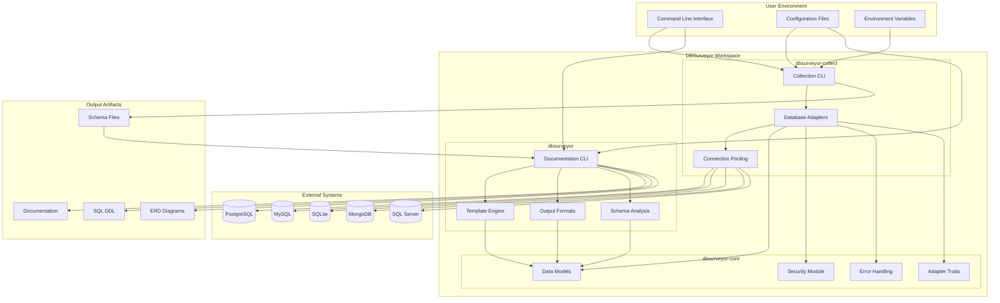

## Crate Architecture

### Workspace Structure

DBSurveyor uses a Cargo workspace with three main crates:

```
dbsurveyor/
├── dbsurveyor-core/     # Shared library
├── dbsurveyor-collect/  # Collection binary
├── dbsurveyor/          # Documentation binary
└── Cargo.toml          # Workspace configuration
```

### Dependency Graph

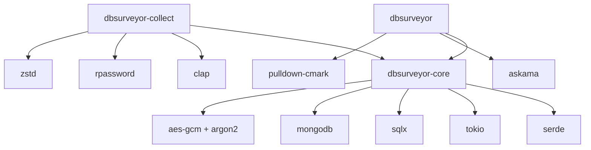

## Core Library (dbsurveyor-core)

### Module Structure

```rust
// dbsurveyor-core/src/lib.rs
pub mod adapters;    // Database adapter traits and factory
pub mod error;       // Comprehensive error handling
pub mod models;      // Unified data models
pub mod security;    // Encryption and credential protection

// Re-exports for public API
pub use adapters::{DatabaseAdapter, create_adapter};
pub use error::{DbSurveyorError, Result};
pub use models::{DatabaseSchema, DatabaseType};
```

### Data Models

The core defines unified data structures that work across all database types:

```rust
// Unified schema representation
pub struct DatabaseSchema {
    pub format_version: String,
    pub database_info: DatabaseInfo,
    pub tables: Vec<Table>,
    pub views: Vec<View>,
    pub indexes: Vec<Index>,
    pub constraints: Vec<Constraint>,
    pub procedures: Vec<Procedure>,
    pub functions: Vec<Procedure>,
    pub triggers: Vec<Trigger>,
    pub custom_types: Vec<CustomType>,
    pub samples: Option<Vec<TableSample>>,
    pub collection_metadata: CollectionMetadata,
}

// Cross-database type mapping
pub enum UnifiedDataType {
    String { max_length: Option<u32> },
    Integer { bits: u8, signed: bool },
    Float { precision: Option<u8> },
    Boolean,
    DateTime { with_timezone: bool },
    Json,
    Array { element_type: Box<UnifiedDataType> },
    Custom { type_name: String },
}
```

### Adapter Pattern

Database adapters implement a common trait for unified access:

```rust
#[async_trait]
pub trait DatabaseAdapter: Send + Sync {
    async fn test_connection(&self) -> Result<()>;
    async fn collect_schema(&self) -> Result<DatabaseSchema>;
    fn database_type(&self) -> DatabaseType;
    fn supports_feature(&self, feature: AdapterFeature) -> bool;
    fn connection_config(&self) -> ConnectionConfig;
}
```

### Factory Pattern

The adapter factory provides database-agnostic instantiation:

```rust
pub async fn create_adapter(connection_string: &str) -> Result<Box<dyn DatabaseAdapter>> {
    let database_type = detect_database_type(connection_string)?;
    
    match database_type {
        DatabaseType::PostgreSQL => {
            #[cfg(feature = "postgresql")]
            {
                let adapter = PostgresAdapter::new(connection_string).await?;
                Ok(Box::new(adapter))
            }
            #[cfg(not(feature = "postgresql"))]
            Err(DbSurveyorError::unsupported_feature("PostgreSQL"))
        }
        // ... other database types
    }
}
```

## Security Architecture

### Credential Protection

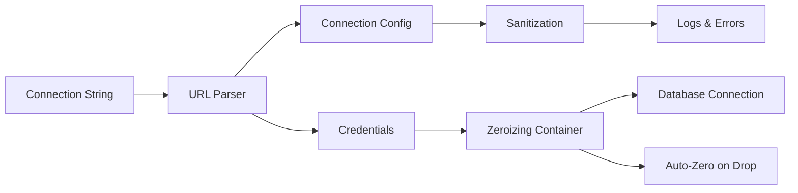

**Implementation**:

```rust
use zeroize::{Zeroize, Zeroizing};

#[derive(Zeroize)]
#[zeroize(drop)]
pub struct Credentials {
    pub username: Zeroizing<String>,
    pub password: Zeroizing<Option<String>>,
}

// Connection config never contains credentials
pub struct ConnectionConfig {
    pub host: String,
    pub port: Option<u16>,
    pub database: Option<String>,
    // No username/password fields
}
```

### Encryption Architecture

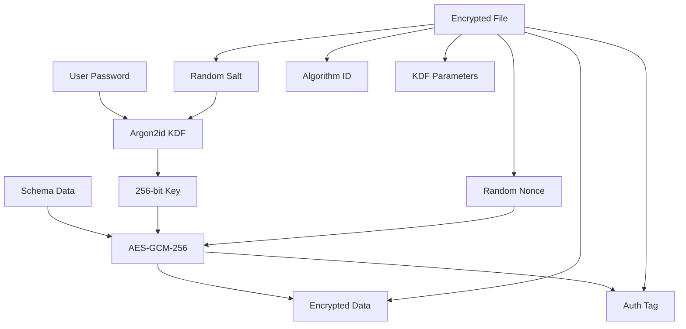

**Security Properties**:

- **Confidentiality**: AES-GCM-256 encryption
- **Integrity**: 128-bit authentication tags
- **Authenticity**: Authenticated encryption prevents tampering
- **Forward Secrecy**: Random nonces prevent replay attacks
- **Key Security**: Argon2id with memory-hard parameters

## Database Adapter Architecture

### Adapter Hierarchy

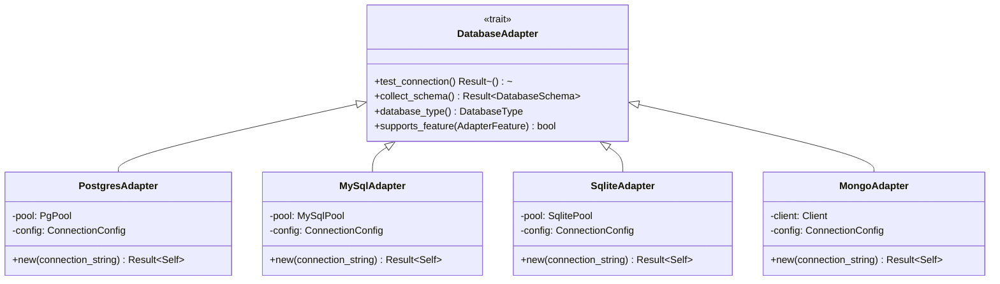

### Connection Pooling

Each adapter manages its own connection pool with security-focused defaults:

```rust
pub struct ConnectionConfig {
    pub connect_timeout: Duration,      // Default: 30s
    pub query_timeout: Duration,        // Default: 30s
    pub max_connections: u32,           // Default: 10
    pub read_only: bool,               // Default: true
}
```

### Feature Flags

Database support is controlled by feature flags for minimal binary size:

```toml
[features]
default = ["postgresql", "sqlite"]
postgresql = ["sqlx", "sqlx/postgres"]
mysql = ["sqlx", "sqlx/mysql"]
sqlite = ["sqlx", "sqlx/sqlite"]
mongodb = ["dep:mongodb"]
mssql = ["dep:tiberius"]
```

## Error Handling Architecture

### Error Hierarchy

```rust
#[derive(Debug, thiserror::Error)]
pub enum DbSurveyorError {
    #[error("Database connection failed")]
    Connection(#[from] ConnectionError),
    
    #[error("Schema collection failed: {context}")]
    Collection { context: String, source: Box<dyn std::error::Error> },
    
    #[error("Configuration error: {message}")]
    Configuration { message: String },
    
    #[error("Encryption operation failed")]
    Encryption(#[from] EncryptionError),
    
    #[error("I/O operation failed: {context}")]
    Io { context: String, source: std::io::Error },
}
```

### Error Context Chain

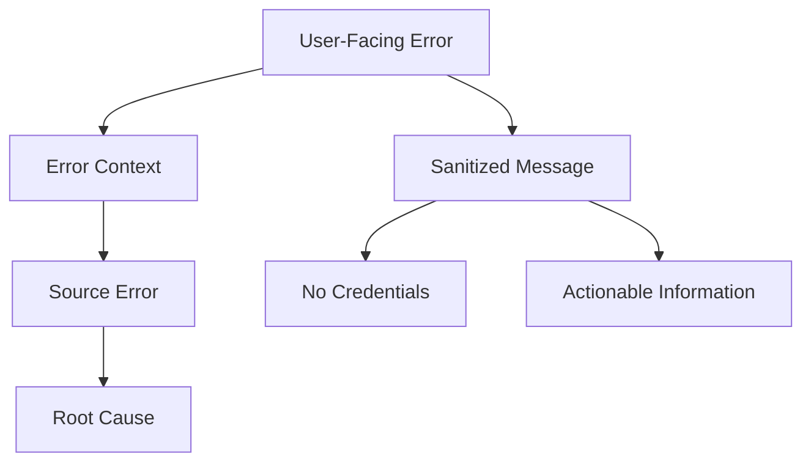

**Security Guarantee**: All error messages are sanitized to prevent credential leakage.

## CLI Architecture

### Command Structure

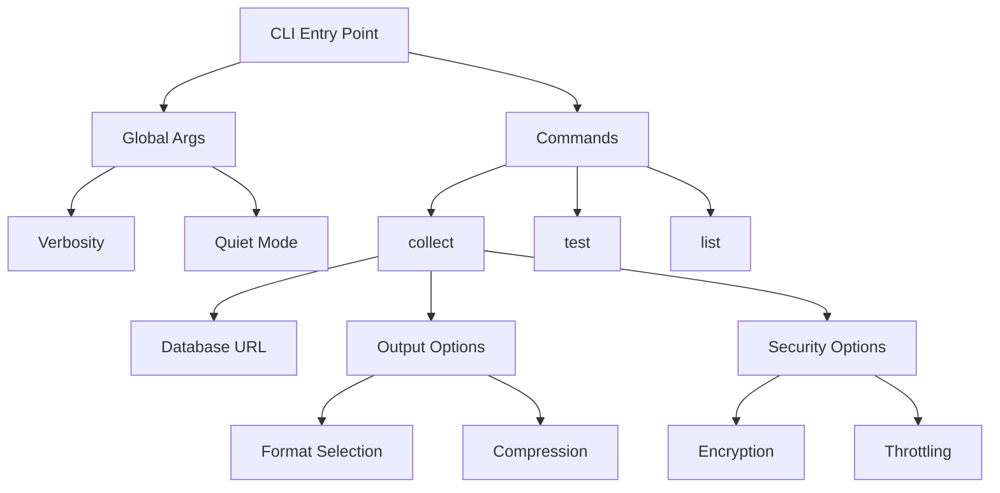

### Configuration Hierarchy

Configuration is loaded from multiple sources with clear precedence:

1. **Command Line Arguments** (highest priority)
2. **Environment Variables**
3. **Project Configuration** (`.dbsurveyor.toml`)
4. **User Configuration** (`~/.config/dbsurveyor/config.toml`)
5. **Default Values** (lowest priority)

## Documentation Generation Architecture

### Template Engine

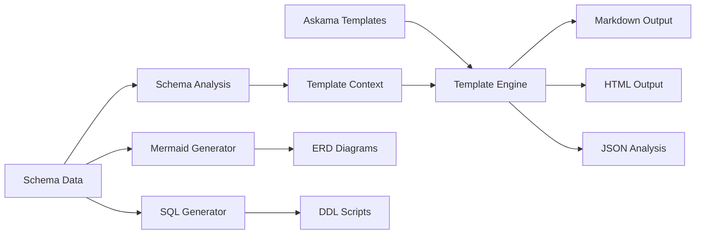

### Output Format Pipeline

```rust
pub trait OutputGenerator {
    fn generate(&self, schema: &DatabaseSchema) -> Result<String>;
    fn file_extension(&self) -> &'static str;
    fn mime_type(&self) -> &'static str;
}

// Implementations for each format
impl OutputGenerator for MarkdownGenerator { ... }
impl OutputGenerator for HtmlGenerator { ... }
impl OutputGenerator for JsonGenerator { ... }
impl OutputGenerator for MermaidGenerator { ... }
```

## Performance Architecture

### Memory Management

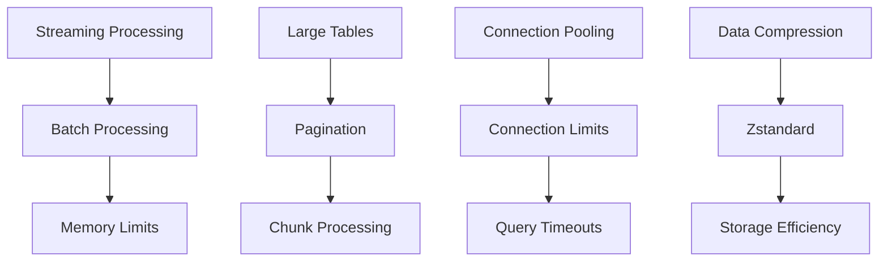

### Concurrency Model

```rust
// Async/await with Tokio runtime
#[tokio::main]
async fn main() -> Result<()> {
    // Connection pooling for concurrent queries
    let pool = PgPoolOptions::new()
        .max_connections(10)
        .connect_timeout(Duration::from_secs(30))
        .connect(&database_url).await?;
    
    // Concurrent schema collection
    let tables = collect_tables(&pool).await?;
    let views = collect_views(&pool).await?;
    let indexes = collect_indexes(&pool).await?;
    
    // Join all concurrent operations
    let (tables, views, indexes) = tokio::try_join!(
        collect_tables(&pool),
        collect_views(&pool),
        collect_indexes(&pool)
    )?;
}
```

## Testing Architecture

### Test Organization

```
tests/
├── integration/          # End-to-end tests
│   ├── postgres_tests.rs
│   ├── mysql_tests.rs
│   └── sqlite_tests.rs
├── security/            # Security-focused tests
│   ├── credential_tests.rs
│   ├── encryption_tests.rs
│   └── offline_tests.rs
└── fixtures/            # Test data
    ├── sample_schemas/
    └── test_databases/
```

### Test Categories

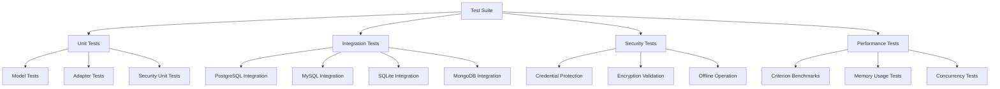

## Build and Distribution Architecture

### Feature Matrix

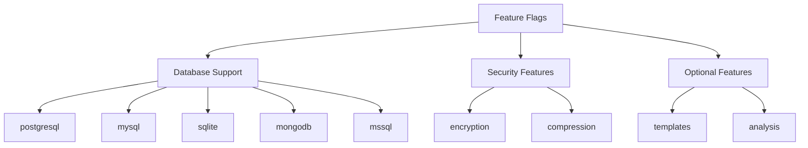

### Binary Variants

```bash
# Default build (PostgreSQL + SQLite)
cargo build --release

# Minimal build (SQLite only)
cargo build --release --no-default-features --features sqlite

# Full build (all databases)
cargo build --release --all-features

# Security-focused build
cargo build --release --features postgresql,sqlite,encryption,compression
```

## Deployment Architecture

### Airgap Deployment

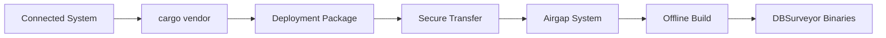

### CI/CD Integration

```yaml
# GitHub Actions workflow
- name: Build and Test
  run: |
    cargo build --all-features
    cargo test --all-features
    just security-full

- name: Generate Documentation
  run: |
    dbsurveyor-collect postgres://${{ secrets.DB_URL }}
    dbsurveyor --format html schema.dbsurveyor.json
```

This architecture ensures DBSurveyor maintains its security-first principles while providing flexibility, performance, and maintainability across all supported platforms and use cases.
