# Architecture

DBSurveyor follows a security-first, modular architecture designed for flexibility, maintainability, and offline operation. This document details the system architecture and design decisions.

## System Overview

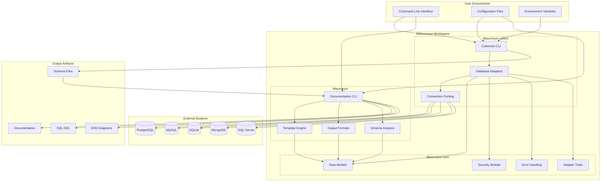
```mermaid
graph TB
    subgraph "User Environment"
        CLI[Command Line Interface]
        CONFIG[Configuration Files]
        ENV[Environment Variables]
    end
    
    subgraph "DBSurveyor Workspace"
        subgraph "dbsurveyor-collect"
            COLLECT_CLI[Collection CLI]
            ADAPTERS[Database Adapters]
            POOL[Connection Pooling]
        end
        
        subgraph "dbsurveyor-core"
            MODELS[Data Models]
            SECURITY[Security Module]
            ERROR[Error Handling]
            TRAITS[Adapter Traits]
        end
        
        subgraph "dbsurveyor"
            DOC_CLI[Documentation CLI]
            TEMPLATES[Template Engine]
            FORMATS[Output Formats]
            ANALYSIS[Schema Analysis]
        end
    end
    
    subgraph "External Systems"
        POSTGRES[(PostgreSQL)]
        MYSQL[(MySQL)]
        SQLITE[(SQLite)]
        MONGODB[(MongoDB)]
        SQLSERVER[(SQL Server)]
    end
    
    subgraph "Output Artifacts"
        JSON[Schema Files]
        DOCS[Documentation]
        SQL[SQL DDL]
        DIAGRAMS[ERD Diagrams]
    end
    
    CLI --> COLLECT_CLI
    CLI --> DOC_CLI
    CONFIG --> COLLECT_CLI
    CONFIG --> DOC_CLI
    ENV --> COLLECT_CLI
    
    COLLECT_CLI --> ADAPTERS
    ADAPTERS --> POOL
    ADAPTERS --> MODELS
    ADAPTERS --> SECURITY
    ADAPTERS --> ERROR
    ADAPTERS --> TRAITS
    
    POOL --> POSTGRES
    POOL --> MYSQL
    POOL --> SQLITE
    POOL --> MONGODB
    POOL --> SQLSERVER
    
    COLLECT_CLI --> JSON
    
    DOC_CLI --> TEMPLATES
    DOC_CLI --> FORMATS
    DOC_CLI --> ANALYSIS
    TEMPLATES --> MODELS
    FORMATS --> MODELS
    ANALYSIS --> MODELS
    
    JSON --> DOC_CLI
    DOC_CLI --> DOCS
    DOC_CLI --> SQL
    DOC_CLI --> DIAGRAMS
```

## Crate Architecture

### Workspace Structure

DBSurveyor uses a Cargo workspace with three main crates:

```
dbsurveyor/
├── dbsurveyor-core/     # Shared library
├── dbsurveyor-collect/  # Collection binary
├── dbsurveyor/          # Documentation binary
└── Cargo.toml          # Workspace configuration
```

### Dependency Graph

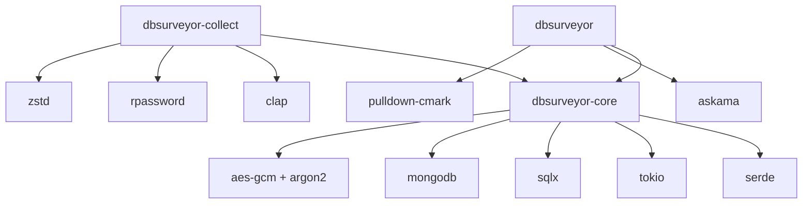
```mermaid
graph TD
    COLLECT[dbsurveyor-collect] --> CORE[dbsurveyor-core]
    DOC[dbsurveyor] --> CORE
    
    CORE --> SERDE[serde]
    CORE --> TOKIO[tokio]
    CORE --> SQLX[sqlx]
    CORE --> MONGO[mongodb]
    CORE --> CRYPTO[aes-gcm + argon2]
    
    COLLECT --> CLAP[clap]
    COLLECT --> RPASS[rpassword]
    COLLECT --> ZSTD[zstd]
    
    DOC --> ASKAMA[askama]
    DOC --> PULLDOWN[pulldown-cmark]
```

## Core Library (dbsurveyor-core)

### Module Structure

```rust
// dbsurveyor-core/src/lib.rs
pub mod adapters; // Database adapter traits and factory
pub mod error; // Comprehensive error handling
pub mod models; // Unified data models
pub mod security; // Encryption and credential protection

// Re-exports for public API
pub use adapters::{create_adapter, DatabaseAdapter};
pub use error::{DbSurveyorError, Result};
pub use models::{DatabaseSchema, DatabaseType};
```

### Data Models

The core defines unified data structures that work across all database types:

```rust
// Unified schema representation
pub struct DatabaseSchema {
    pub format_version: String,
    pub database_info: DatabaseInfo,
    pub tables: Vec<Table>,
    pub views: Vec<View>,
    pub indexes: Vec<Index>,
    pub constraints: Vec<Constraint>,
    pub procedures: Vec<Procedure>,
    pub functions: Vec<Procedure>,
    pub triggers: Vec<Trigger>,
    pub custom_types: Vec<CustomType>,
    pub samples: Option<Vec<TableSample>>,
    pub collection_metadata: CollectionMetadata,
}

// Cross-database type mapping
pub enum UnifiedDataType {
    String { max_length: Option<u32> },
    Integer { bits: u8, signed: bool },
    Float { precision: Option<u8> },
    Boolean,
    DateTime { with_timezone: bool },
    Json,
    Array { element_type: Box<UnifiedDataType> },
    Custom { type_name: String },
}
```

### Adapter Pattern

Database adapters implement a common trait for unified access:

```rust
#[async_trait]
pub trait DatabaseAdapter: Send + Sync {
    async fn test_connection(&self) -> Result<()>;
    async fn collect_schema(&self) -> Result<DatabaseSchema>;
    fn database_type(&self) -> DatabaseType;
    fn supports_feature(&self, feature: AdapterFeature) -> bool;
    fn connection_config(&self) -> ConnectionConfig;
}
```

### Factory Pattern

The adapter factory provides database-agnostic instantiation:

```rust
pub async fn create_adapter(connection_string: &str) -> Result<Box<dyn DatabaseAdapter>> {
    let database_type = detect_database_type(connection_string)?;
    
    match database_type {
        DatabaseType::PostgreSQL => {
            #[cfg(feature = "postgresql")]
            {
                let adapter = PostgresAdapter::new(connection_string).await?;
                Ok(Box::new(adapter))
            }
            #[cfg(not(feature = "postgresql"))]
            Err(DbSurveyorError::unsupported_feature("PostgreSQL"))
        }
        // ... other database types
    }
}
```

## Security Architecture

### Credential Protection

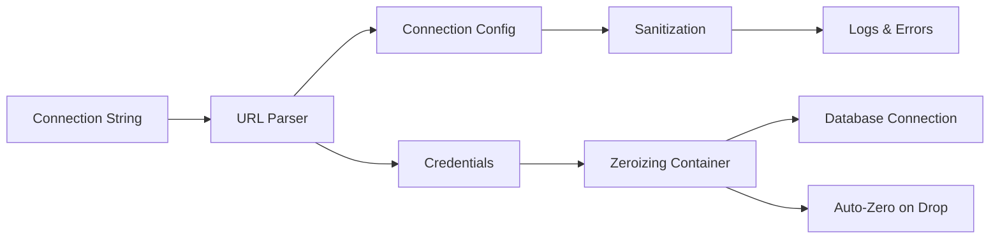
```mermaid
graph LR
    INPUT[Connection String] --> PARSE[URL Parser]
    PARSE --> CONFIG[Connection Config]
    PARSE --> CREDS[Credentials]
    
    CONFIG --> SANITIZE[Sanitization]
    CREDS --> ZEROIZE[Zeroizing Container]
    
    SANITIZE --> LOGS[Logs & Errors]
    ZEROIZE --> DATABASE[Database Connection]
    ZEROIZE --> MEMORY[Auto-Zero on Drop]
```

**Implementation**:

```rust
use zeroize::{Zeroize, Zeroizing};

#[derive(Zeroize)]
#[zeroize(drop)]
pub struct Credentials {
    pub username: Zeroizing<String>,
    pub password: Zeroizing<Option<String>>,
}

// Connection config never contains credentials
pub struct ConnectionConfig {
    pub host: String,
    pub port: Option<u16>,
    pub database: Option<String>,
    // No username/password fields
}
```

### Encryption Architecture

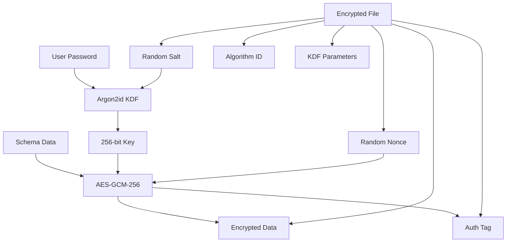
```mermaid
graph TD
    PASSWORD[User Password] --> ARGON2[Argon2id KDF]
    SALT[Random Salt] --> ARGON2
    ARGON2 --> KEY[256-bit Key]
    
    DATA[Schema Data] --> AES[AES-GCM-256]
    KEY --> AES
    NONCE[Random Nonce] --> AES
    
    AES --> CIPHERTEXT[Encrypted Data]
    AES --> TAG[Auth Tag]
    
    ENCRYPTED[Encrypted File] --> ALGORITHM[Algorithm ID]
    ENCRYPTED --> NONCE
    ENCRYPTED --> CIPHERTEXT
    ENCRYPTED --> TAG
    ENCRYPTED --> KDF_PARAMS[KDF Parameters]
    ENCRYPTED --> SALT
```

**Security Properties**:

- **Confidentiality**: AES-GCM-256 encryption
- **Integrity**: 128-bit authentication tags
- **Authenticity**: Authenticated encryption prevents tampering
- **Forward Secrecy**: Random nonces prevent replay attacks
- **Key Security**: Argon2id with memory-hard parameters

## Database Adapter Architecture

### Adapter Hierarchy

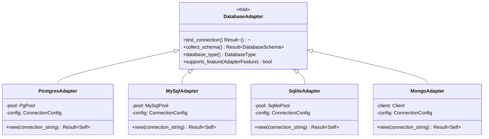
```mermaid
classDiagram
    class DatabaseAdapter {
        <<trait>>
        +test_connection() Result~()~
        +collect_schema() Result~DatabaseSchema~
        +database_type() DatabaseType
        +supports_feature(AdapterFeature) bool
    }
    
    class PostgresAdapter {
        -pool: PgPool
        -config: ConnectionConfig
        +new(connection_string) Result~Self~
    }
    
    class MySqlAdapter {
        -pool: MySqlPool
        -config: ConnectionConfig
        +new(connection_string) Result~Self~
    }
    
    class SqliteAdapter {
        -pool: SqlitePool
        -config: ConnectionConfig
        +new(connection_string) Result~Self~
    }
    
    class MongoAdapter {
        -client: Client
        -config: ConnectionConfig
        +new(connection_string) Result~Self~
    }
    
    DatabaseAdapter <|-- PostgresAdapter
    DatabaseAdapter <|-- MySqlAdapter
    DatabaseAdapter <|-- SqliteAdapter
    DatabaseAdapter <|-- MongoAdapter
```

### Connection Pooling

Each adapter manages its own connection pool with security-focused defaults:

```rust
pub struct ConnectionConfig {
    pub connect_timeout: Duration, // Default: 30s
    pub query_timeout: Duration,   // Default: 30s
    pub max_connections: u32,      // Default: 10
    pub read_only: bool,           // Default: true
}
```

### Feature Flags

Database support is controlled by feature flags for minimal binary size:

```toml
[features]
default = ["postgresql", "sqlite"]
postgresql = ["sqlx", "sqlx/postgres"]
mysql = ["sqlx", "sqlx/mysql"]
sqlite = ["sqlx", "sqlx/sqlite"]
mongodb = ["dep:mongodb"]
mssql = ["dep:tiberius"]
```

## Error Handling Architecture

### Error Hierarchy

```rust
#[derive(Debug, thiserror::Error)]
pub enum DbSurveyorError {
    #[error("Database connection failed")]
    Connection(#[from] ConnectionError),

    #[error("Schema collection failed: {context}")]
    Collection {
        context: String,
        source: Box<dyn std::error::Error>,
    },

    #[error("Configuration error: {message}")]
    Configuration { message: String },

    #[error("Encryption operation failed")]
    Encryption(#[from] EncryptionError),

    #[error("I/O operation failed: {context}")]
    Io {
        context: String,
        source: std::io::Error,
    },
}
```

### Error Context Chain

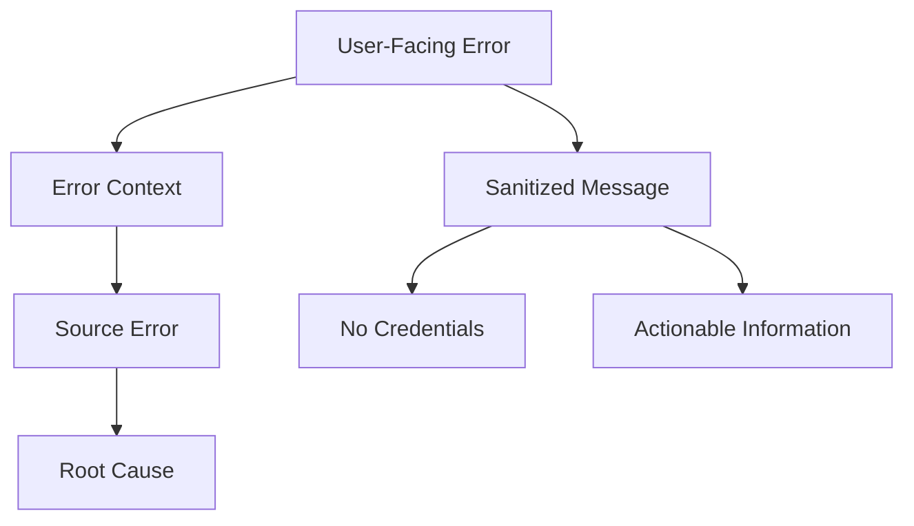
```mermaid
graph TD
    USER_ERROR[User-Facing Error] --> CONTEXT[Error Context]
    CONTEXT --> SOURCE[Source Error]
    SOURCE --> ROOT[Root Cause]
    
    USER_ERROR --> SANITIZED[Sanitized Message]
    SANITIZED --> NO_CREDS[No Credentials]
    SANITIZED --> ACTIONABLE[Actionable Information]
```

**Security Guarantee**: All error messages are sanitized to prevent credential leakage.

## CLI Architecture

### Command Structure

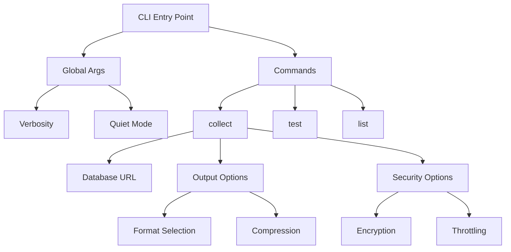
```mermaid
graph TD
    CLI[CLI Entry Point] --> GLOBAL[Global Args]
    CLI --> COMMANDS[Commands]
    
    GLOBAL --> VERBOSE[Verbosity]
    GLOBAL --> QUIET[Quiet Mode]
    
    COMMANDS --> COLLECT[collect]
    COMMANDS --> TEST[test]
    COMMANDS --> LIST[list]
    
    COLLECT --> DB_URL[Database URL]
    COLLECT --> OUTPUT[Output Options]
    COLLECT --> SECURITY[Security Options]
    
    OUTPUT --> FORMAT[Format Selection]
    OUTPUT --> COMPRESSION[Compression]
    
    SECURITY --> ENCRYPTION[Encryption]
    SECURITY --> THROTTLE[Throttling]
```

### Configuration Hierarchy

Configuration is loaded from multiple sources with clear precedence:

1. **Command Line Arguments** (highest priority)
2. **Environment Variables**
3. **Project Configuration** (`.dbsurveyor.toml`)
4. **User Configuration** (`~/.config/dbsurveyor/config.toml`)
5. **Default Values** (lowest priority)

## Documentation Generation Architecture

### Template Engine

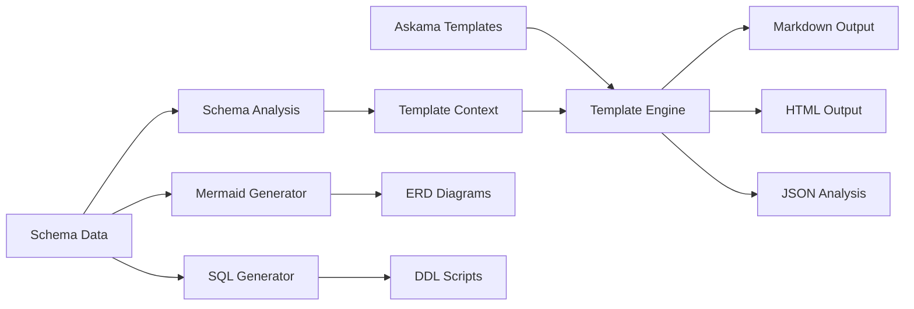
```mermaid
graph LR
    SCHEMA[Schema Data] --> ANALYSIS[Schema Analysis]
    ANALYSIS --> CONTEXT[Template Context]
    
    TEMPLATES[Askama Templates] --> ENGINE[Template Engine]
    CONTEXT --> ENGINE
    
    ENGINE --> MARKDOWN[Markdown Output]
    ENGINE --> HTML[HTML Output]
    ENGINE --> JSON[JSON Analysis]
    
    SCHEMA --> MERMAID[Mermaid Generator]
    MERMAID --> ERD[ERD Diagrams]
    
    SCHEMA --> SQL[SQL Generator]
    SQL --> DDL[DDL Scripts]
```

### Output Format Pipeline

```rust
pub trait OutputGenerator {
    fn generate(&self, schema: &DatabaseSchema) -> Result<String>;
    fn file_extension(&self) -> &'static str;
    fn mime_type(&self) -> &'static str;
}

// Implementations for each format
impl OutputGenerator for MarkdownGenerator { ... }
impl OutputGenerator for HtmlGenerator { ... }
impl OutputGenerator for JsonGenerator { ... }
impl OutputGenerator for MermaidGenerator { ... }
```

## Performance Architecture

### Memory Management

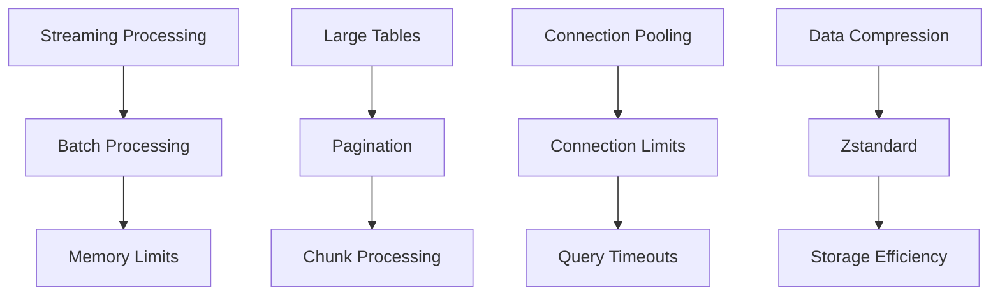
```mermaid
graph TD
    STREAMING[Streaming Processing] --> BATCHES[Batch Processing]
    BATCHES --> MEMORY[Memory Limits]
    
    LARGE_TABLES[Large Tables] --> PAGINATION[Pagination]
    PAGINATION --> CHUNKS[Chunk Processing]
    
    CONNECTIONS[Connection Pooling] --> LIMITS[Connection Limits]
    LIMITS --> TIMEOUTS[Query Timeouts]
    
    COMPRESSION[Data Compression] --> ZSTD[Zstandard]
    ZSTD --> EFFICIENCY[Storage Efficiency]
```

### Concurrency Model

```rust
// Async/await with Tokio runtime
#[tokio::main]
async fn main() -> Result<()> {
    // Connection pooling for concurrent queries
    let pool = PgPoolOptions::new()
        .max_connections(10)
        .connect_timeout(Duration::from_secs(30))
        .connect(&database_url).await?;
    
    // Concurrent schema collection
    let tables = collect_tables(&pool).await?;
    let views = collect_views(&pool).await?;
    let indexes = collect_indexes(&pool).await?;
    
    // Join all concurrent operations
    let (tables, views, indexes) = tokio::try_join!(
        collect_tables(&pool),
        collect_views(&pool),
        collect_indexes(&pool)
    )?;
}
```

## Testing Architecture

### Test Organization

```
tests/
├── integration/          # End-to-end tests
│   ├── postgres_tests.rs
│   ├── mysql_tests.rs
│   └── sqlite_tests.rs
├── security/            # Security-focused tests
│   ├── credential_tests.rs
│   ├── encryption_tests.rs
│   └── offline_tests.rs
└── fixtures/            # Test data
    ├── sample_schemas/
    └── test_databases/
```

### Test Categories

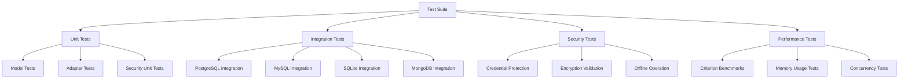
```mermaid
graph TD
    TESTS[Test Suite] --> UNIT[Unit Tests]
    TESTS --> INTEGRATION[Integration Tests]
    TESTS --> SECURITY[Security Tests]
    TESTS --> PERFORMANCE[Performance Tests]
    
    UNIT --> MODELS[Model Tests]
    UNIT --> ADAPTERS[Adapter Tests]
    UNIT --> SECURITY_UNIT[Security Unit Tests]
    
    INTEGRATION --> POSTGRES[PostgreSQL Integration]
    INTEGRATION --> MYSQL[MySQL Integration]
    INTEGRATION --> SQLITE[SQLite Integration]
    INTEGRATION --> MONGODB[MongoDB Integration]
    
    SECURITY --> CREDENTIALS[Credential Protection]
    SECURITY --> ENCRYPTION[Encryption Validation]
    SECURITY --> OFFLINE[Offline Operation]
    
    PERFORMANCE --> BENCHMARKS[Criterion Benchmarks]
    PERFORMANCE --> MEMORY[Memory Usage Tests]
    PERFORMANCE --> CONCURRENCY[Concurrency Tests]
```

## Build and Distribution Architecture

### Feature Matrix

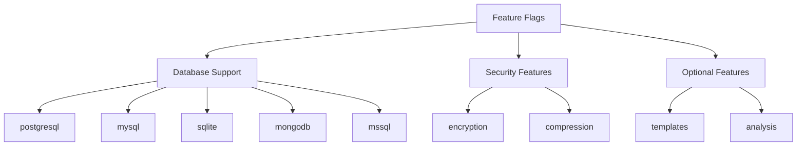
```mermaid
graph TD
    FEATURES[Feature Flags] --> DATABASES[Database Support]
    FEATURES --> SECURITY[Security Features]
    FEATURES --> OPTIONAL[Optional Features]
    
    DATABASES --> POSTGRES[postgresql]
    DATABASES --> MYSQL[mysql]
    DATABASES --> SQLITE[sqlite]
    DATABASES --> MONGODB[mongodb]
    DATABASES --> MSSQL[mssql]
    
    SECURITY --> ENCRYPTION[encryption]
    SECURITY --> COMPRESSION[compression]
    
    OPTIONAL --> TEMPLATES[templates]
    OPTIONAL --> ANALYSIS[analysis]
```

### Binary Variants

DBSurveyor produces multiple binary variants to support different database environments. GoReleaser v2 builds 7 distinct binaries:

- **`dbsurveyor`** - Documentation postprocessor (all features)
- **`dbsurveyor-collect`** - Data collection tool with variants:
  - `all` - PostgreSQL, MySQL, SQLite, MongoDB, MSSQL
  - `postgresql` - PostgreSQL only
  - `mysql` - MySQL only
  - `sqlite` - SQLite only
  - `mongodb` - MongoDB only
  - `mssql` - MSSQL only

Each variant is built with specific feature flags:

```bash
# All features (default release artifacts)
cargo zigbuild --release --all-features -p=dbsurveyor-collect

# PostgreSQL-only variant
cargo zigbuild --release --no-default-features \
  --features=postgresql,compression,encryption -p=dbsurveyor-collect

# SQLite-only variant
cargo zigbuild --release --no-default-features \
  --features=sqlite,compression,encryption -p=dbsurveyor-collect
```

**Artifact Naming**: Release artifacts follow the pattern:

```
dbsurveyor_{variant}_{OS}_{arch}.{tar.gz|zip}
```

Examples:

- `dbsurveyor_all_Linux_x86_64.tar.gz`
- `dbsurveyor_postgresql_Darwin_x86_64.tar.gz`
- `dbsurveyor_sqlite_Windows_x86_64.zip`

## Deployment Architecture

### Airgap Deployment

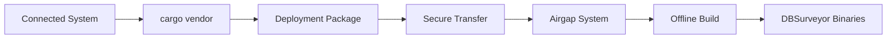
```mermaid
graph LR
    CONNECTED[Connected System] --> VENDOR[cargo vendor]
    VENDOR --> PACKAGE[Deployment Package]
    
    PACKAGE --> TRANSFER[Secure Transfer]
    TRANSFER --> AIRGAP[Airgap System]
    
    AIRGAP --> OFFLINE_BUILD[Offline Build]
    OFFLINE_BUILD --> BINARIES[DBSurveyor Binaries]
```

### CI/CD Integration

DBSurveyor uses GoReleaser v2 with cargo-zigbuild for cross-compilation:

```yaml
# GitHub Actions release workflow
  - name: Install Rust toolchain
    uses: dtolnay/rust-toolchain@stable
    with:
      toolchain: 1.93.1

  - name: Install Zig
    uses: mlugg/setup-zig@v2
    with:
      version: 0.13.0

  - name: Install cargo-zigbuild
    run: cargo install --locked cargo-zigbuild --version 0.19.8

  - name: Install Cosign
    uses: sigstore/cosign-installer@v3

  - name: Install Syft
    uses: anchore/sbom-action/download-syft@v0

  - name: Run GoReleaser
    uses: goreleaser/goreleaser-action@v6
    with:
      distribution: goreleaser
      version: ~> v2
      args: release --clean
    env:
      GITHUB_TOKEN: ${{ secrets.GITHUB_TOKEN }}
      HOMEBREW_TAP_TOKEN: ${{ secrets.HOMEBREW_TAP_TOKEN }}
```

**Cross-Compilation Targets** (6 platforms):

- `x86_64-unknown-linux-gnu` - Linux x86_64 (glibc)
- `aarch64-unknown-linux-gnu` - Linux ARM64 (glibc)
- `x86_64-unknown-linux-musl` - Linux x86_64 (musl/Alpine)
- `x86_64-apple-darwin` - macOS Intel
- `aarch64-apple-darwin` - macOS Apple Silicon
- `x86_64-pc-windows-gnu` - Windows x86_64

The postprocessor and the per-driver collector variants (`postgresql`, `mysql`, `sqlite`, `mongodb`) build for all six targets. The `all` and `mssql` collector variants exclude `x86_64-unknown-linux-musl`: the `mssql` feature pulls `tiberius` with `native-tls`, which links system OpenSSL and cannot statically link against musl. Static-musl users should pick a per-driver variant.

**Security Features**:

- **Cosign Keyless Signing**: Checksums are signed using GitHub OIDC identity
- **Syft SBOM Generation**: Software Bill of Materials for all archives
- **Reproducible Builds**: Consistent timestamps via `{{ .CommitTimestamp }}`

This architecture ensures DBSurveyor maintains its security-first principles while providing flexibility, performance, and maintainability across all supported platforms and use cases.
