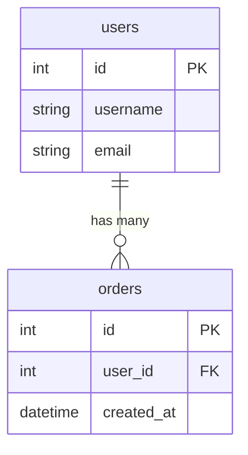

# Documentation Generation

The `dbsurveyor` tool processes collected schema files and generates comprehensive documentation in multiple formats. This guide covers all documentation generation features.

## Basic Documentation Generation

### Generate Markdown Documentation

```bash
# Generate Markdown (default format)
dbsurveyor generate schema.dbsurveyor.json

# Explicit format specification
dbsurveyor --format markdown schema.dbsurveyor.json

# Custom output file
dbsurveyor --format markdown --output database-docs.md schema.json
```

### Generate HTML Reports

```bash
# Generate HTML report with search functionality
dbsurveyor --format html schema.dbsurveyor.json

# Custom output location
dbsurveyor --format html --output reports/database.html schema.json
```

## Output Formats

DBSurveyor supports multiple documentation formats:

### Markdown Documentation

**Best for**: Version control, wikis, README files

```bash
dbsurveyor --format markdown schema.json
```

**Features**:

- Clean, readable text format
- Table of contents with navigation
- Code blocks for SQL examples
- Compatible with GitHub, GitLab, etc.

**Example Output Structure**:

```markdown
# Database Schema: mydb

## Summary
- **Tables**: 15
- **Views**: 3
- **Indexes**: 28

## Tables

### users
- **Schema**: public
- **Rows**: ~1,250

| Column | Type | Nullable | Default |
|--------|------|----------|---------|
| id | INTEGER | NO | nextval('users_id_seq') |
| username | VARCHAR(50) | NO | |
| email | VARCHAR(255) | YES | |
```

### HTML Reports

**Best for**: Interactive browsing, presentations, sharing

```bash
dbsurveyor --format html schema.json
```

**Features**:

- Interactive search and filtering
- Collapsible sections
- Syntax highlighting
- Responsive design
- Offline-capable (no external dependencies)

### JSON Analysis

**Best for**: Programmatic processing, integration with other tools

```bash
dbsurveyor --format json schema.json
```

**Features**:

- Structured data for automation
- Statistics and metrics
- Relationship analysis
- Machine-readable format

**Example Output**:

```json
{
  "database_name": "mydb",
  "analysis": {
    "table_count": 15,
    "view_count": 3,
    "index_count": 28,
    "constraint_count": 42
  },
  "relationships": [
    {
      "from_table": "orders",
      "to_table": "users",
      "relationship_type": "foreign_key"
    }
  ]
}
```

### Mermaid ERD Diagrams

**Best for**: Visual database design, architecture documentation

```bash
dbsurveyor --format mermaid schema.json
```

**Features**:

- Entity Relationship Diagrams
- Visual table relationships
- Compatible with Mermaid.js
- Can be embedded in Markdown

**Example Output**:



## Advanced Features

### SQL DDL Reconstruction

Generate SQL DDL scripts to recreate the database structure:

```bash
# PostgreSQL DDL
dbsurveyor sql schema.json --dialect postgresql --output recreate.sql

# MySQL DDL
dbsurveyor sql schema.json --dialect mysql --output mysql-schema.sql

# Generic SQL (ANSI standard)
dbsurveyor sql schema.json --dialect generic --output portable.sql
```

**Supported Dialects**:

- `postgresql` - PostgreSQL-specific syntax
- `mysql` - MySQL-specific syntax
- `sqlite` - SQLite-specific syntax
- `sqlserver` - SQL Server-specific syntax
- `generic` - ANSI SQL standard

### Schema Analysis

Get detailed insights about your database structure:

```bash
# Basic analysis
dbsurveyor analyze schema.json

# Detailed analysis with statistics
dbsurveyor analyze schema.json --detailed
```

**Analysis Output**:

```
Schema Analysis: mydb
================
Tables: 15
Views: 3
Indexes: 28
Constraints: 42

Detailed Analysis:
- Procedures: 5
- Functions: 12
- Triggers: 8
- Custom Types: 3

Relationship Analysis:
- Foreign Key Relationships: 18
- Self-Referencing Tables: 2
- Orphaned Tables: 1
```

### Schema Validation

Verify schema file integrity and format:

```bash
dbsurveyor validate schema.dbsurveyor.json
```

**Validation Checks**:

- File format correctness
- Schema version compatibility
- Data integrity verification
- Warning detection

## Working with Encrypted Files

DBSurveyor can process encrypted schema files:

```bash
# Process encrypted file (will prompt for password)
dbsurveyor generate schema.enc

# All formats work with encrypted input
dbsurveyor --format html schema.enc
dbsurveyor sql schema.enc --dialect postgresql
```

**Security Notes**:

- Password prompts are secure (no echo)
- Decryption happens in memory only
- Original encrypted file remains unchanged

## Working with Compressed Files

Process compressed schema files automatically:

```bash
# Compressed files are detected automatically
dbsurveyor generate schema.dbsurveyor.json.zst

# Works with all output formats
dbsurveyor --format html schema.json.zst
```

## Data Redaction

Control sensitive data visibility in generated documentation:

### Redaction Modes

```bash
# No redaction (show all data)
dbsurveyor --redact-mode none schema.json

# Minimal redaction (only obvious sensitive fields)
dbsurveyor --redact-mode minimal schema.json

# Balanced redaction (recommended default)
dbsurveyor --redact-mode balanced schema.json

# Conservative redaction (maximum privacy)
dbsurveyor --redact-mode conservative schema.json

# Disable all redaction
dbsurveyor --no-redact schema.json
```

### Redaction Examples

| Mode | Password Field | Email Field | ID Field |
|------|----------------|-------------|----------|
| `none` | `password123` | `user@example.com` | `12345` |
| `minimal` | `[REDACTED]` | `user@example.com` | `12345` |
| `balanced` | `[REDACTED]` | `[EMAIL]` | `12345` |
| `conservative` | `[REDACTED]` | `[REDACTED]` | `[ID]` |

## Batch Processing

Process multiple schema files:

```bash
# Process all schema files in directory
for file in *.dbsurveyor.json; do
    dbsurveyor --format html "$file"
done

# Generate multiple formats from one schema
for format in markdown html mermaid; do
    dbsurveyor --format "$format" schema.json
done
```

## Integration Examples

### CI/CD Pipeline

```yaml
# GitHub Actions example
- name: Generate Database Documentation
  run: |
    dbsurveyor-collect postgres://${{ secrets.DB_URL }}
    dbsurveyor --format html --output docs/database.html schema.dbsurveyor.json
    dbsurveyor --format markdown --output docs/DATABASE.md schema.dbsurveyor.json
```

### Documentation Website

```bash
# Generate documentation for website
dbsurveyor --format html --output public/database.html schema.json
dbsurveyor --format mermaid --output docs/erd.mmd schema.json

# Include in static site generator
cp schema.html docs/_includes/database-schema.html
```

### Version Control

```bash
# Track schema changes over time
git add schema.dbsurveyor.json
git commit -m "Update database schema documentation"

# Generate diff-friendly markdown
dbsurveyor --format markdown schema.json
git add schema.md
git commit -m "Update schema documentation"
```

## Customization and Templating

### Template Customization

DBSurveyor uses the Askama template engine. Future versions will support custom templates:

```bash
# Custom template (planned feature)
dbsurveyor --template custom.html.j2 --format html schema.json
```

### Output Customization

```bash
# Custom CSS for HTML output (planned feature)
dbsurveyor --format html --css custom.css schema.json

# Custom header/footer (planned feature)
dbsurveyor --format html --header header.html --footer footer.html schema.json
```

## Performance Considerations

### Large Schema Files

```bash
# For large schemas, use streaming processing
dbsurveyor --format json schema.json  # Most efficient

# HTML generation may be slower for very large schemas
dbsurveyor --format html large-schema.json  # May take time
```

### Memory Usage

- **JSON format**: Minimal memory usage
- **Markdown format**: Low memory usage
- **HTML format**: Moderate memory usage (includes search index)
- **Mermaid format**: Low memory usage

## Troubleshooting

### Common Issues

**File not found**:

```bash
# Check file exists and has correct extension
ls -la *.dbsurveyor.json *.enc *.zst
```

**Permission denied**:

```bash
# Check file permissions
chmod 644 schema.dbsurveyor.json
```

**Invalid format**:

```bash
# Validate schema file first
dbsurveyor validate schema.json
```

**Encryption password issues**:

```bash
# Ensure you're using the correct password
# Password prompts don't show characters for security
```

### Debug Mode

```bash
# Enable verbose logging
dbsurveyor -vvv generate schema.json

# Check file format
file schema.dbsurveyor.json
```

## Next Steps

After generating documentation:

1. **Review Output**: Check generated documentation for accuracy
2. **Share Securely**: Consider redaction levels for different audiences
3. **Integrate**: Include documentation in your workflow or website
4. **Automate**: Set up regular documentation updates
5. **Version Control**: Track documentation changes over time

See the [Configuration](./configuration.md) guide for advanced customization options.
