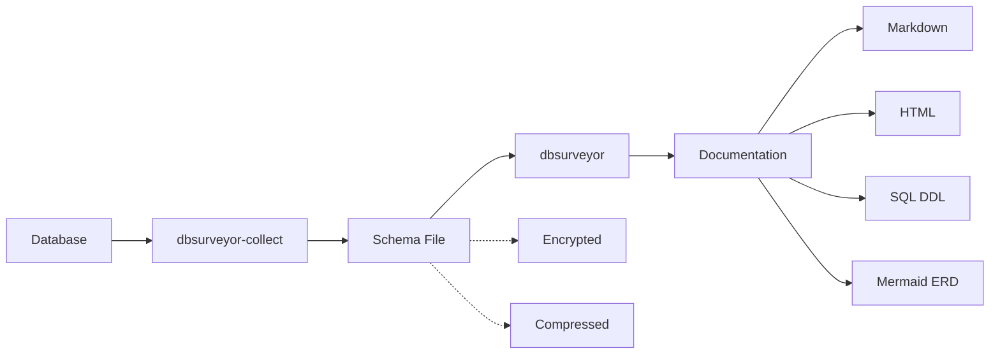

# Introduction

DBSurveyor is a security-focused, offline-first database analysis and documentation toolchain designed for security professionals, database administrators, and DevOps teams.

## Core Purpose

Generate comprehensive, secure database schema documentation for PostgreSQL, MySQL, SQLite, and MongoDB databases without compromising security or requiring persistent network connectivity.

## Key Features

- **Dual-Binary Architecture**: Separate collector (`dbsurveyor-collect`) and postprocessor (`dbsurveyor`) for flexible workflows
- **Database Support**: PostgreSQL (✅), SQLite (✅), MySQL (🚧), MongoDB (🚧), SQL Server (🚧)
- **Security-First Design**: AES-GCM encryption, credential protection, zero telemetry
- **Offline Operation**: Complete functionality in air-gapped environments
- **Documentation Generation**: Markdown (✅), JSON analysis (✅), HTML/ERD (🚧 in development)

## Security Guarantees

- **NO NETWORK CALLS**: Operates completely offline after initial installation, beyond the collector connection to the target database
- **NO TELEMETRY**: Zero data collection, usage tracking, or external reporting
- **NO CREDENTIALS IN OUTPUTS**: Database credentials never stored in output files
- **AES-GCM ENCRYPTION**: Industry-standard authenticated encryption for sensitive outputs
- **AIRGAP COMPATIBLE**: Full functionality in air-gapped environments

## Target Users

- **Red Team Operators**: Post-compromise database enumeration in contested environments
- **Blue Team Analysts**: Auditing unknown systems and inherited databases
- **Database Administrators**: Comprehensive documentation and compliance reporting
- **Security Analysts**: Database security assessment and risk identification
- **System Administrators**: Exploring inherited or legacy databases with minimal documentation

## Architecture Overview

DBSurveyor uses a dual-binary architecture that separates data collection from documentation generation:

This separation provides several benefits:

- **Security**: Collection can happen in secure environments, documentation generation offline
- **Flexibility**: Multiple documentation formats from a single collection
- **Portability**: Schema files can be transferred between environments
- **Auditability**: Clear separation between data collection and processing
