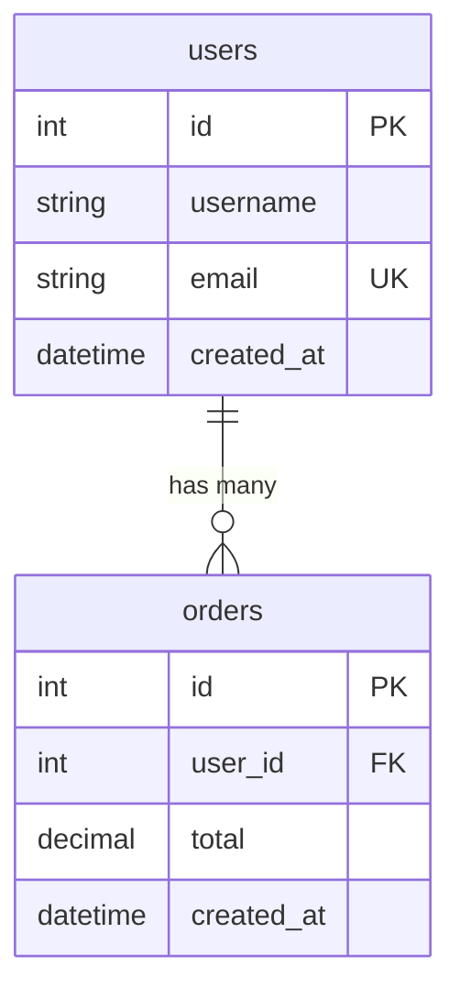

# Output Formats

DBSurveyor generates structured output in multiple formats to support different use cases and workflows.

## Schema File Formats

### Standard JSON Format (.dbsurveyor.json)

The primary output format is a JSON file following the DBSurveyor Schema v1.0 specification:

```json
{
  "format_version": "1.0",
  "database_info": {
    "name": "production_db",
    "version": "13.7",
    "size_bytes": 1073741824,
    "encoding": "UTF8",
    "collation": "en_US.UTF-8",
    "access_level": "Full",
    "collection_status": "Success"
  },
  "tables": [
    {
      "name": "users",
      "schema": "public",
      "columns": [
        {
          "name": "id",
          "data_type": {"Integer": {"bits": 32, "signed": true}},
          "is_nullable": false,
          "is_primary_key": true,
          "is_auto_increment": true,
          "ordinal_position": 1
        }
      ],
      "primary_key": {
        "name": "users_pkey",
        "columns": ["id"]
      },
      "foreign_keys": [],
      "indexes": [],
      "constraints": []
    }
  ],
  "views": [],
  "indexes": [],
  "constraints": [],
  "procedures": [],
  "functions": [],
  "triggers": [],
  "custom_types": [],
  "collection_metadata": {
    "collected_at": "2024-01-15T10:30:00Z",
    "collection_duration_ms": 1500,
    "collector_version": "1.0.0",
    "warnings": []
  }
}
```

### Compressed Format (.dbsurveyor.json.zst)

Large schema files can be compressed using Zstandard compression:

```bash
# Generate compressed output
dbsurveyor-collect --compress postgres://localhost/large_db

# Postprocessor automatically detects and decompresses
dbsurveyor generate schema.dbsurveyor.json.zst
```

**Benefits:**

- 60-80% size reduction for large schemas
- Fast compression/decompression
- Maintains full data integrity

### Encrypted Format (.enc)

Sensitive schema data can be encrypted using AES-GCM-256:

```bash
# Generate encrypted output (prompts for password)
dbsurveyor-collect --encrypt postgres://localhost/sensitive_db

# Postprocessor prompts for decryption password
dbsurveyor generate schema.enc
```

**Security Features:**

- AES-GCM-256 authenticated encryption
- Argon2id key derivation (64 MiB memory, 3 iterations)
- Random 96-bit nonces (never reused)
- Embedded KDF parameters for decryption

**Encrypted File Structure:**

```json
{
  "algorithm": "AES-GCM-256",
  "nonce": [/* 12 bytes */],
  "ciphertext": [/* encrypted data */],
  "auth_tag": [/* 16 bytes */],
  "kdf_params": {
    "salt": [/* 16 bytes */],
    "memory_cost": 65536,
    "time_cost": 3,
    "parallelism": 4,
    "version": "1.3"
  }
}
```

## Documentation Formats

### Markdown Documentation (.md)

**Status**: ✅ Implemented

Basic Markdown documentation with schema overview:

```bash
dbsurveyor generate schema.json --format markdown
```

**Output Example:**

```markdown
# Database Schema: production_db

Generated by DBSurveyor v1.0.0
Collection Date: 2024-01-15 10:30:00 UTC

## Summary

- **Tables**: 25
- **Views**: 3
- **Indexes**: 47

## Tables

### users
- **Schema**: public
- **Columns**: 5
- **Primary Key**: id
```

### JSON Analysis Report (.json)

**Status**: ✅ Implemented

Structured analysis data for programmatic consumption:

```bash
dbsurveyor analyze schema.json --detailed
```

**Output Example:**

```json
{
  "database_name": "production_db",
  "table_count": 25,
  "view_count": 3,
  "index_count": 47,
  "constraint_count": 32,
  "collection_date": "2024-01-15T10:30:00Z",
  "analysis": {
    "largest_table": "audit_log",
    "most_indexes": "users",
    "foreign_key_relationships": 18
  }
}
```

### HTML Report (.html)

**Status**: 🚧 Placeholder Implementation

Interactive HTML reports with search and navigation:

```bash
dbsurveyor generate schema.json --format html
```

**Planned Features:**

- Interactive table browser
- Search functionality
- Relationship visualization
- Responsive design for mobile/desktop
- Offline-compatible (no external dependencies)

### Mermaid ERD (.mmd)

**Status**: 🚧 Placeholder Implementation

Entity Relationship Diagrams using Mermaid syntax:

```bash
dbsurveyor generate schema.json --format mermaid
```

**Planned Output:**



### SQL DDL (.sql)

**Status**: 🚧 Placeholder Implementation

Reconstructed SQL DDL for schema recreation:

```bash
dbsurveyor sql schema.json --dialect postgresql --output recreate.sql
```

**Planned Features:**

- Multiple SQL dialect support (PostgreSQL, MySQL, SQLite, SQL Server)
- Complete schema recreation scripts
- Data type mapping between databases
- Constraint and index recreation
- Migration script generation

## Unified Data Type System

DBSurveyor uses a unified type system to represent data types across different databases:

### Basic Types

```json
{
  "String": {"max_length": 255},
  "Integer": {"bits": 32, "signed": true},
  "Float": {"precision": 53},
  "Boolean": null,
  "Date": null,
  "DateTime": {"with_timezone": true},
  "Time": {"with_timezone": false}
}
```

### Advanced Types

```json
{
  "Binary": {"max_length": 1024},
  "Json": null,
  "Uuid": null,
  "Array": {
    "element_type": {"String": {"max_length": 50}}
  },
  "Custom": {"type_name": "user_status_enum"}
}
```

### Database-Specific Mapping

| DBSurveyor Type | PostgreSQL | MySQL | SQLite | MongoDB |
|-----------------|------------|-------|--------|---------|
| `String` | `VARCHAR`, `TEXT` | `VARCHAR`, `TEXT` | `TEXT` | `string` |
| `Integer` | `INTEGER`, `BIGINT` | `INT`, `BIGINT` | `INTEGER` | `int`, `long` |
| `Float` | `REAL`, `DOUBLE` | `FLOAT`, `DOUBLE` | `REAL` | `double` |
| `Boolean` | `BOOLEAN` | `BOOLEAN` | `INTEGER` | `bool` |
| `Json` | `JSON`, `JSONB` | `JSON` | `TEXT` | `object` |
| `Array` | `ARRAY[]` | `JSON` | `TEXT` | `array` |
| `Custom` | `ENUM`, `DOMAIN` | `ENUM` | N/A | N/A |

## Schema Validation

All output files are validated against the DBSurveyor JSON Schema v1.0:

### Validation Features

- **Format Version Checking**: Ensures compatibility
- **Required Field Validation**: All mandatory fields present
- **Data Type Validation**: Correct type structure
- **Security Validation**: No credential fields allowed
- **Relationship Validation**: Foreign key consistency

### Validation Errors

```bash
# Validate a schema file
dbsurveyor validate schema.json

# Example validation error
Error: Schema validation failed
- Missing required field: collection_metadata.collected_at
- Invalid data type: expected Integer, found String
- Security violation: credential field detected in column default_value
```

## File Size Considerations

### Compression Recommendations

| Schema Size | Recommendation | Expected Compression |
|-------------|----------------|---------------------|
| < 1 MB | Standard JSON | N/A |
| 1-10 MB | Zstandard compression | 60-70% reduction |
| > 10 MB | Compression + chunking | 70-80% reduction |

### Large Schema Handling

For very large databases (1000+ tables):

```bash
# Use compression for large schemas
dbsurveyor-collect --compress postgres://localhost/large_db

# Consider sampling for development
dbsurveyor-collect --sample 10 postgres://localhost/large_db
```

## Security Considerations

### Credential Protection

All output formats guarantee:

- No database credentials in any output file
- Connection strings sanitized in metadata
- Error messages sanitized
- Validation prevents credential leakage

### Encryption Best Practices

```bash
# Use strong passwords for encryption
dbsurveyor-collect --encrypt postgres://localhost/sensitive_db

# Verify encrypted file integrity
dbsurveyor validate schema.enc
```

### Airgap Compatibility

All formats work completely offline:

- No external dependencies in generated files
- Self-contained documentation
- Local-only processing
- No network calls during generation

## Format Evolution

### Version Compatibility

- **v1.0**: Current format with full backward compatibility
- **Future versions**: Additive changes only
- **Migration tools**: Automatic format upgrades
- **Deprecation policy**: 2-version support window

### Schema Extensions

The format supports extensions for:

- Database-specific features
- Custom metadata
- Plugin-generated data
- Performance metrics

## Integration Examples

### CI/CD Pipeline

```yaml
# Generate schema documentation in CI
- name: Collect Database Schema
  run: |
    dbsurveyor-collect --compress $DATABASE_URL
    dbsurveyor generate schema.dbsurveyor.json.zst --format markdown

- name: Upload Documentation
  uses: actions/upload-artifact@v3
  with:
    name: database-docs
    path: schema.md
```

### Programmatic Access

```python
import json

# Load schema data
with open('schema.dbsurveyor.json') as f:
    schema = json.load(f)

# Analyze tables
for table in schema['tables']:
    print(f"Table: {table['name']}")
    print(f"Columns: {len(table['columns'])}")
```

### Documentation Automation

```bash
#!/bin/bash
# Automated documentation generation

# Collect from multiple environments
dbsurveyor-collect --output prod.json $PROD_DB_URL
dbsurveyor-collect --output staging.json $STAGING_DB_URL

# Generate documentation
dbsurveyor generate prod.json --format html --output prod-schema.html
dbsurveyor generate staging.json --format html --output staging-schema.html

# Compare schemas (future feature)
# dbsurveyor compare prod.json staging.json --output diff.html
```

This comprehensive output format system ensures that DBSurveyor can adapt to various workflows while maintaining security and compatibility guarantees.
