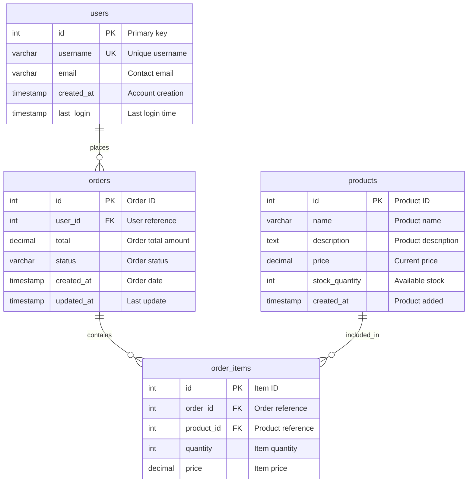

# Output Formats

DBSurveyor supports multiple output formats for both schema collection and documentation generation. This guide details all available formats and their use cases.

## Collection Output Formats

The `dbsurveyor-collect` tool generates schema files in these formats:

### Standard JSON (.dbsurveyor.json)

**Default format** for schema collection.

```bash
# Generate standard JSON
dbsurveyor-collect postgres://localhost/db
# Creates: schema.dbsurveyor.json
```

**Characteristics**:

- Human-readable JSON with pretty printing
- Complete schema metadata
- Compatible with all documentation generators
- No compression or encryption

**Example Structure**:

```json
{
  "format_version": "1.0",
  "database_info": {
    "name": "mydb",
    "version": "13.7",
    "size_bytes": 1048576,
    "encoding": "UTF8",
    "collation": "en_US.UTF-8"
  },
  "tables": [
    {
      "name": "users",
      "schema": "public",
      "columns": [
        {
          "name": "id",
          "data_type": {
            "Integer": { "bits": 32, "signed": true }
          },
          "is_nullable": false,
          "is_primary_key": true,
          "ordinal_position": 1
        }
      ],
      "primary_key": {
        "name": "users_pkey",
        "columns": ["id"]
      }
    }
  ],
  "collection_metadata": {
    "collected_at": "2024-01-15T10:30:00Z",
    "collection_duration_ms": 5432,
    "collector_version": "0.1.0",
    "warnings": []
  }
}
```

### Compressed JSON (.dbsurveyor.json.zst)

**Zstandard compressed** format for large schemas.

```bash
# Generate compressed format
dbsurveyor-collect --compress postgres://localhost/db
# Creates: schema.dbsurveyor.json.zst
```

**Characteristics**:

- 60-80% size reduction typical
- Fast compression/decompression
- Maintains full schema fidelity
- Automatic detection by documentation tools

**Use Cases**:

- Large databases (>1000 tables)
- Network transfer optimization
- Long-term storage
- CI/CD artifact optimization

**Compression Stats Example**:

```bash
# Original: 2.5 MB
# Compressed: 450 KB (82% reduction)
ls -lh schema.*
# -rw-r--r-- 1 user user 2.5M schema.dbsurveyor.json
# -rw-r--r-- 1 user user 450K schema.dbsurveyor.json.zst
```

### Encrypted JSON (.enc)

**AES-GCM encrypted** format for sensitive schemas.

```bash
# Generate encrypted format (prompts for password)
dbsurveyor-collect --encrypt postgres://localhost/db
# Creates: schema.enc
```

**Characteristics**:

- AES-GCM-256 authenticated encryption
- Random 96-bit nonces (never reused)
- Argon2id key derivation
- Embedded KDF parameters and salt
- Password-based encryption

**Security Features**:

- **Algorithm**: AES-GCM-256
- **Nonce**: 96-bit random (12 bytes)
- **Auth Tag**: 128-bit (16 bytes)
- **KDF**: Argon2id v1.3
- **Salt**: 128-bit random (16 bytes)
- **Memory Cost**: 64 MiB
- **Time Cost**: 3 iterations
- **Parallelism**: 4 threads

**Encrypted File Structure**:

```json
{
  "algorithm": "AES-GCM-256",
  "nonce": [/* 12 bytes */],
  "ciphertext": [/* encrypted schema data */],
  "auth_tag": [/* 16 bytes */],
  "kdf_params": {
    "salt": [/* 16 bytes */],
    "memory_cost": 65536,
    "time_cost": 3,
    "parallelism": 4,
    "version": "1.3"
  }
}
```

### Combined Formats

```bash
# Compressed + Encrypted (maximum efficiency + security)
dbsurveyor-collect --compress --encrypt postgres://localhost/db
# Creates: schema.enc (compressed data is encrypted)
```

## Documentation Output Formats

The `dbsurveyor` tool generates documentation in multiple formats:

### Markdown Documentation

**Best for**: Version control, wikis, documentation sites

```bash
# Generate Markdown (default)
dbsurveyor generate schema.dbsurveyor.json
# Creates: schema.md
```

**Features**:

- Clean, readable text format
- Table of contents with navigation
- Code blocks for SQL examples
- Compatible with GitHub, GitLab, etc.
- Mermaid diagram integration

**Example Output**:

````markdown
# Database Schema: mydb

Generated by DBSurveyor v0.1.0  
Collection Date: 2024-01-15 10:30:00 UTC

## Summary

- **Database**: mydb (PostgreSQL 13.7)
- **Tables**: 15
- **Views**: 3
- **Indexes**: 28
- **Constraints**: 42

## Tables

### users

**Schema**: public  
**Rows**: ~1,250  
**Size**: 128 KB

| Column | Type | Nullable | Default | Description |
|--------|------|----------|---------|-------------|
| id | INTEGER | NO | nextval('users_id_seq') | Primary key |
| username | VARCHAR(50) | NO | | Unique username |
| email | VARCHAR(255) | YES | | Contact email |
| created_at | TIMESTAMP | NO | CURRENT_TIMESTAMP | Creation time |

#### Indexes

- **users_pkey** (PRIMARY): id
- **users_username_key** (UNIQUE): username
- **idx_users_email**: email

#### Constraints

- **users_pkey**: PRIMARY KEY (id)
- **users_username_key**: UNIQUE (username)

### orders

**Schema**: public  
**Rows**: ~5,430  
**Size**: 512 KB

| Column | Type | Nullable | Default | Description |
|--------|------|----------|---------|-------------|
| id | INTEGER | NO | nextval('orders_id_seq') | Primary key |
| user_id | INTEGER | NO | | Foreign key to users |
| total | DECIMAL(10,2) | NO | | Order total |
| created_at | TIMESTAMP | NO | CURRENT_TIMESTAMP | Order date |

#### Foreign Keys

- **fk_orders_user_id**: user_id → users(id)

## Entity Relationship Diagram

```mermaid
erDiagram
    users {
        int id PK
        varchar username UK
        varchar email
        timestamp created_at
    }
    orders {
        int id PK
        int user_id FK
        decimal total
        timestamp created_at
    }
    users ||--o{ orders : "has many"
````

## Views

### active_users

**Schema**: public\
**Definition**:

```sql
SELECT id, username, email 
FROM users 
WHERE last_login > (CURRENT_DATE - INTERVAL '30 days');
```

````

### HTML Reports

**Best for**: Interactive browsing, presentations, sharing

```bash
# Generate HTML report
dbsurveyor --format html schema.dbsurveyor.json
# Creates: schema.html
````

**Features**:

- Interactive search and filtering
- Collapsible sections
- Syntax highlighting
- Responsive design
- Offline-capable (no external dependencies)
- Dark/light theme support

**HTML Structure**:

```html
<!DOCTYPE html>
<html>
<head>
    <title>Database Schema: mydb</title>
    <style>/* Embedded CSS */</style>
</head>
<body>
    <nav><!-- Table of contents --></nav>
    <main>
        <header>
            <h1>Database Schema: mydb</h1>
            <div class="search-box">
                <input type="text" placeholder="Search tables, columns...">
            </div>
        </header>
        
        <section class="summary">
            <!-- Database summary -->
        </section>
        
        <section class="tables">
            <!-- Interactive table listings -->
        </section>
    </main>
    <script>/* Embedded JavaScript */</script>
</body>
</html>
```

### JSON Analysis

**Best for**: Programmatic processing, integration, APIs

```bash
# Generate JSON analysis
dbsurveyor --format json schema.dbsurveyor.json
# Creates: schema_analysis.json
```

**Features**:

- Structured data for automation
- Statistics and metrics
- Relationship analysis
- Machine-readable format
- API integration ready

**Example Output**:

```json
{
  "database_name": "mydb",
  "database_type": "PostgreSQL",
  "analysis_date": "2024-01-15T10:30:00Z",
  "summary": {
    "table_count": 15,
    "view_count": 3,
    "index_count": 28,
    "constraint_count": 42,
    "procedure_count": 5,
    "function_count": 12,
    "trigger_count": 8,
    "custom_type_count": 3
  },
  "size_analysis": {
    "total_size_bytes": 10485760,
    "largest_tables": [
      {
        "name": "audit_log",
        "size_bytes": 5242880,
        "row_count": 125000
      }
    ]
  },
  "relationships": [
    {
      "from_table": "orders",
      "from_column": "user_id",
      "to_table": "users",
      "to_column": "id",
      "relationship_type": "foreign_key",
      "constraint_name": "fk_orders_user_id"
    }
  ],
  "data_types": {
    "most_common": [
      { "type": "INTEGER", "count": 45 },
      { "type": "VARCHAR", "count": 38 },
      { "type": "TIMESTAMP", "count": 22 }
    ]
  },
  "naming_patterns": {
    "table_naming": "snake_case",
    "column_naming": "snake_case",
    "common_prefixes": ["id", "created", "updated"],
    "common_suffixes": ["_id", "_at", "_date"]
  }
}
```

### Mermaid ERD Diagrams

**Best for**: Visual database design, architecture documentation

```bash
# Generate Mermaid ERD
dbsurveyor --format mermaid schema.dbsurveyor.json
# Creates: schema.mmd
```

**Features**:

- Entity Relationship Diagrams
- Visual table relationships
- Compatible with Mermaid.js
- Can be embedded in Markdown
- GitHub/GitLab integration

**Example Output**:



## SQL DDL Reconstruction

**Best for**: Database migration, schema recreation

```bash
# Generate PostgreSQL DDL
dbsurveyor sql schema.dbsurveyor.json --dialect postgresql
# Creates: schema.sql

# Generate MySQL DDL
dbsurveyor sql schema.dbsurveyor.json --dialect mysql --output mysql-schema.sql
```

**Supported Dialects**:

- `postgresql` - PostgreSQL-specific syntax
- `mysql` - MySQL-specific syntax
- `sqlite` - SQLite-specific syntax
- `sqlserver` - SQL Server-specific syntax
- `generic` - ANSI SQL standard

**Example PostgreSQL Output**:

```sql
-- Database Schema: mydb
-- Generated by DBSurveyor v0.1.0
-- Source: PostgreSQL 13.7

-- Create schemas
CREATE SCHEMA IF NOT EXISTS public;

-- Create custom types
CREATE TYPE status_enum AS ENUM ('active', 'inactive', 'pending');

-- Create tables
CREATE TABLE public.users (
    id INTEGER NOT NULL DEFAULT nextval('users_id_seq'::regclass),
    username VARCHAR(50) NOT NULL,
    email VARCHAR(255),
    status status_enum DEFAULT 'active',
    created_at TIMESTAMP WITHOUT TIME ZONE NOT NULL DEFAULT CURRENT_TIMESTAMP,
    last_login TIMESTAMP WITHOUT TIME ZONE
);

CREATE TABLE public.orders (
    id INTEGER NOT NULL DEFAULT nextval('orders_id_seq'::regclass),
    user_id INTEGER NOT NULL,
    total DECIMAL(10,2) NOT NULL,
    status VARCHAR(20) DEFAULT 'pending',
    created_at TIMESTAMP WITHOUT TIME ZONE NOT NULL DEFAULT CURRENT_TIMESTAMP,
    updated_at TIMESTAMP WITHOUT TIME ZONE
);

-- Create sequences
CREATE SEQUENCE users_id_seq
    START WITH 1
    INCREMENT BY 1
    NO MINVALUE
    NO MAXVALUE
    CACHE 1;

CREATE SEQUENCE orders_id_seq
    START WITH 1
    INCREMENT BY 1
    NO MINVALUE
    NO MAXVALUE
    CACHE 1;

-- Create primary keys
ALTER TABLE public.users ADD CONSTRAINT users_pkey PRIMARY KEY (id);
ALTER TABLE public.orders ADD CONSTRAINT orders_pkey PRIMARY KEY (id);

-- Create unique constraints
ALTER TABLE public.users ADD CONSTRAINT users_username_key UNIQUE (username);

-- Create foreign keys
ALTER TABLE public.orders 
    ADD CONSTRAINT fk_orders_user_id 
    FOREIGN KEY (user_id) REFERENCES public.users(id);

-- Create indexes
CREATE INDEX idx_users_email ON public.users USING btree (email);
CREATE INDEX idx_orders_status ON public.orders USING btree (status);
CREATE INDEX idx_orders_created_at ON public.orders USING btree (created_at);

-- Create views
CREATE VIEW public.active_users AS
    SELECT id, username, email, created_at
    FROM public.users
    WHERE status = 'active' AND last_login > (CURRENT_DATE - INTERVAL '30 days');

-- Create functions
CREATE OR REPLACE FUNCTION update_updated_at_column()
RETURNS TRIGGER AS $$
BEGIN
    NEW.updated_at = CURRENT_TIMESTAMP;
    RETURN NEW;
END;
$$ language 'plpgsql';

-- Create triggers
CREATE TRIGGER update_orders_updated_at
    BEFORE UPDATE ON public.orders
    FOR EACH ROW
    EXECUTE FUNCTION update_updated_at_column();
```

## Format Comparison

| Format     | Size   | Speed  | Features    | Use Case          |
| ---------- | ------ | ------ | ----------- | ----------------- |
| JSON       | Large  | Fast   | Complete    | Development, APIs |
| Compressed | Small  | Fast   | Complete    | Storage, transfer |
| Encrypted  | Medium | Medium | Secure      | Sensitive data    |
| Markdown   | Medium | Fast   | Readable    | Documentation     |
| HTML       | Large  | Medium | Interactive | Presentations     |
| Mermaid    | Small  | Fast   | Visual      | Architecture      |
| SQL DDL    | Medium | Fast   | Executable  | Migration         |

## File Extensions and Detection

DBSurveyor automatically detects file formats based on extensions:

| Extension          | Format        | Auto-Detection |
| ------------------ | ------------- | -------------- |
| `.json`            | Standard JSON | ✅             |
| `.dbsurveyor.json` | Standard JSON | ✅             |
| `.zst`             | Compressed    | ✅             |
| `.json.zst`        | Compressed    | ✅             |
| `.enc`             | Encrypted     | ✅             |
| `.md`              | Markdown      | ✅             |
| `.html`            | HTML          | ✅             |
| `.mmd`             | Mermaid       | ✅             |
| `.sql`             | SQL DDL       | ✅             |

## Best Practices

### Collection Format Selection

```bash
# Development: Use standard JSON
dbsurveyor-collect postgres://localhost/dev_db

# Production: Use encryption
dbsurveyor-collect --encrypt postgres://prod-server/db

# Large databases: Use compression
dbsurveyor-collect --compress postgres://warehouse/big_db

# Maximum security: Use both
dbsurveyor-collect --compress --encrypt postgres://sensitive/db
```

### Documentation Format Selection

```bash
# Version control: Use Markdown
dbsurveyor --format markdown schema.json

# Presentations: Use HTML
dbsurveyor --format html schema.json

# Architecture docs: Use Mermaid
dbsurveyor --format mermaid schema.json

# Automation: Use JSON
dbsurveyor --format json schema.json

# Migration: Use SQL DDL
dbsurveyor sql schema.json --dialect postgresql
```

### Multi-Format Generation

```bash
# Generate all formats
for format in markdown html json mermaid; do
    dbsurveyor --format $format schema.dbsurveyor.json
done

# Generate SQL for multiple dialects
for dialect in postgresql mysql sqlite; do
    dbsurveyor sql schema.json --dialect $dialect --output schema-$dialect.sql
done
```

This comprehensive format support ensures DBSurveyor can integrate into any workflow or toolchain while maintaining security and performance requirements.
