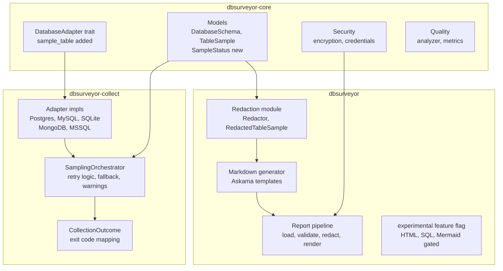

# Tech Plan: DBSurveyor Implementation Architecture

## Architectural Approach

### Key Design Decisions

#### 1. Adapter trait extended with `sample_table()`, retry in the collector layer

The existing `DatabaseAdapter` trait in file:dbsurveyor-core/src/adapters/mod.rs is extended with a new `sample_table()` method. Each adapter implements the raw sampling mechanics for its engine. The retry-once-with-smaller-size policy and per-table fallback (random ordering + warning) are applied in the collector binary's calling layer — not inside any adapter. This keeps the trait clean, makes the retry policy consistent across all adapters, and ensures warnings are surfaced at the orchestration level where they can be attached to `DatabaseSchema.collection_metadata.warnings` and to the per-table `TableSample.warnings`.

The existing `SamplingStrategy`, `OrderingStrategy`, and `TableSample` models in file:dbsurveyor-core/src/models.rs cover this without change. No new data models are required for sampling.

**`--sample 0`**\*\* semantics\*\*: The `--sample` CLI flag in `dbsurveyor-collect` uses `0` to mean "use the default sample size" (currently 100 rows). The collector must treat `0` as a sentinel that resolves to the default before constructing `SamplingConfig`. This is enforced in the CLI argument parsing layer, not in the adapter or orchestrator. The `SamplingConfig.sample_size` field must never receive `0` — it always carries the resolved value.

#### 2. Experimental output modes gated by Cargo feature flag

A new `experimental` feature flag is added to file:dbsurveyor/Cargo.toml. The `OutputFormat` enum in the postprocessor binary's `main.rs` only includes `Html`, `Json`, and `Mermaid` variants when `#[cfg(feature = "experimental")]` is active. In standard builds these modes are entirely absent — they do not appear in `--help`, cannot be passed on the command line, and produce no dead code. This matches the existing feature-flag pattern already used for `encryption`, `compression`, and database adapters.

#### 3. Redaction pipeline is private to the postprocessor binary

A `redaction` module lives inside the `dbsurveyor` postprocessor crate only. It is not exposed through `dbsurveyor-core`. This enforces the architectural boundary that the collector never redacts, and prevents accidental reuse of redaction logic in the wrong binary. The module owns the `RedactionMode` enum, the `Redactor` type, and all pattern-matching logic. It takes a `&[TableSample]` and returns `Vec<RedactedTableSample>` — a new local type that wraps the same row data with values masked according to the active mode.

#### 4. Markdown generation uses Askama templates

`askama` is already a workspace dependency. Markdown output for the postprocessor is rendered via compiled Askama templates (`.md` template files). This provides type-safe binding between the `DatabaseSchema` data model and the template, catches template errors at compile time, and positions the codebase to add HTML templates later without a different rendering approach. Templates live inside the `dbsurveyor` crate's source tree.

#### 5. Return-code taxonomy for multi-database partial outcomes

The collector binary's `main()` function maps collection outcomes to explicit process exit codes. The mapping is:

| Outcome                                                                | Exit code |
| ---------------------------------------------------------------------- | --------- |
| All databases collected successfully                                   | `0`       |
| Total failure (no data collected)                                      | `1`       |
| Partial success — some data but all samples failed                     | `2`       |
| Partial success — some databases fully collected, some without samples | `3`       |
| Partial success — collection complete but validation warnings present  | `4`       |
| Canceled operation (e.g., encryption password mismatch)                | `5`       |

Precedence is strict and single-code: if multiple partial conditions occur, emit only the highest-priority category. Priority order (highest to lowest):

1. `PartialWithoutSamples`
2. `PartialWithData`
3. `PartialWithValidationWarnings`

**Skipped databases and partial-success**: Any database that is skipped — including privilege-based skips — forces a partial-success outcome. Full success (`0`) is only emitted when every discovered database is collected successfully with no skips, no sample failures, and no validation warnings. The `CollectionOutcome` aggregation logic must treat `CollectionStatus::Skipped` the same as a partial failure when computing the outcome category.

**Canceled operation**: Password mismatch during encryption is not a collection failure — it is a user-initiated cancellation. It maps to exit code `5` (`Canceled`) and writes no output file. This is distinct from `1` (total failure) and must not be conflated with collection errors.

This is implemented via a dedicated `CollectionOutcome` type in the collector binary that aggregates per-database results and produces the correct exit code, using `std::process::exit()` after the async runtime completes.

### Constraints

- All new code must pass `cargo clippy -- -D warnings` with zero warnings.
- The `experimental` feature must never be included in release binary artifacts distributed via GoReleaser.
- Release pipeline for `dbsurveyor` must use explicit feature lists (e.g., `compression,encryption`) instead of `--all-features` to enforce the gating contract.
- No new network dependencies. All added types must be `Send + Sync`.
- The `DatabaseAdapter` trait must remain object-safe after adding `sample_table()`.
- `SamplingConfig.sample_size` must never be `0` at the adapter or orchestrator level; `--sample 0` is resolved to the default before `SamplingConfig` is constructed.
- Exit code `5` (`Canceled`) is reserved for user-initiated cancellations (e.g., password mismatch). It must not be used for collection errors or infrastructure failures.

## Data Model

### Changes to existing models (no breaking changes)

The core data models in file:dbsurveyor-core/src/models.rs are already sufficient for sampling, partial-success metadata, and multi-database collection. No structural changes are needed.

One additive change: `TableSample` gets an optional `sample_status` field to distinguish a fully sampled table, a partially-sampled table (smaller sample used on retry), and a skipped table, while preserving format version `1.0` compatibility. This field is already implemented in file:dbsurveyor-core/src/models.rs.

```rust
pub enum SampleStatus {
    Complete,
    PartialRetry { original_limit: u32 },
    Skipped { reason: String },
}
```

`sample_status` is optional in serialized output for backward compatibility with existing `1.0` files. Safe default behavior: if `sample_status` is missing, consumers treat it as legacy/unspecified and continue processing without failure.

### New types in the postprocessor binary

`**RedactedTableSample**` — local to `dbsurveyor` crate, not serialized to disk:

```rust
pub struct RedactedTableSample {
    pub table_name: String,
    pub schema_name: Option<String>,
    pub rows: Vec<serde_json::Value>, // values masked per RedactionMode
    pub mode_applied: RedactionMode,
    pub warnings: Vec<String>,
}
```

`**CollectionOutcome**` — local to `dbsurveyor-collect` binary:

```rust
pub enum CollectionOutcome {
    Success,
    TotalFailure { error: String },
    PartialWithoutSamples,
    PartialWithData,
    PartialWithValidationWarnings,
    Canceled { reason: String },
}
```

Maps to exit codes `0`, `1`, `2`, `3`, `4`, `5` respectively, with strict single-code precedence: `PartialWithoutSamples` > `PartialWithData` > `PartialWithValidationWarnings`. `Canceled` is not subject to precedence — it is always emitted directly when a user-initiated cancellation occurs (e.g., password mismatch) and bypasses the aggregation logic entirely.

## Component Architecture



### Component responsibilities

#### `DatabaseAdapter` trait — extended (in `dbsurveyor-core`)

A new schema-qualified sampling contract is added:

`async fn sample_table(&self, table_ref: TableRef<'_>, config: &SamplingConfig) -> Result<TableSample>`

The method is responsible only for executing the sampling query with the best available ordering for that table reference. `SamplingConfig` already exists in file:dbsurveyor-core/src/adapters/config/mod.rs.

To remain object-safe, this method must use `async_trait` (already applied to the trait). Each adapter implementing `sample_table()` independently uses the ordering strategy that fits its engine (PK for PostgreSQL, `_id` for MongoDB, `ROWID` for SQLite, etc.). Using schema-qualified table identity prevents ambiguous sampling in multi-schema databases.

#### `SamplingOrchestrator` — new, in `dbsurveyor-collect`

Owns the policy: for each table, call `adapter.sample_table()`. On failure, retry once with `sample_size / 2`. If the retry fails or if `OrderingStrategy::Unordered` is selected, fall back to `SamplingStrategy::Random` and add a warning. Attach all warnings to the returned `TableSample.warnings` and to the parent `DatabaseSchema.collection_metadata.warnings`. Produces a `SampleStatus` per table.

**`--sample 0`**\*\* resolution\*\*: Before constructing `SamplingConfig`, the orchestrator's caller (the `collect_schema` function in `main.rs`) resolves `cli.sample == 0` to the default sample size constant. The orchestrator itself never receives `0` as a sample size.

**search_path-aware ordering detection (PostgreSQL)**: When `TableRef.schema_name` is `None`, the PostgreSQL adapter must not silently default to `"public"` for ordering detection. Instead, it must query the session's active `search_path` (via `SHOW search_path` or `current_schema()`) and use the first non-`"$user"` schema that contains the target table. If no schema can be resolved, the adapter emits a warning and falls back to `OrderingStrategy::Unordered`. This behavior is tracked in ticket:a851bd63-14cc-4ca5-a046-39862bd0e0a7/53d55225-8a46-4c3e-81c2-95dd2e7070e4 and applies only to the PostgreSQL adapter — other adapters have their own schema resolution semantics.

#### `CollectionOutcome` — new, in `dbsurveyor-collect`

Aggregates `DatabaseSchema.database_info.collection_status` (for single DB) or `DatabaseServerSchema.databases[*].database_info.collection_status` (for multi-DB) to compute the appropriate `CollectionOutcome` variant. `main()` calls `std::process::exit(outcome.exit_code())` after the Tokio runtime finishes.

**Skipped database handling**: `CollectionStatus::Skipped` is treated as a partial-success condition during aggregation. A run where all accessible databases are collected but one or more are skipped (for any reason, including privilege-based skips) must not produce `CollectionOutcome::Success`. The aggregation logic must inspect all `CollectionStatus` variants — `Success`, `Failed`, and `Skipped` — and select the highest-priority partial-success category accordingly.

**Canceled operation path**: When `save_schema` returns a password-mismatch error (detected by error variant or a dedicated `OperationCanceled` error type), `main()` maps this directly to `CollectionOutcome::Canceled` and calls `std::process::exit(5)` without entering the partial-success aggregation path.

#### Experimental feature flag — in `dbsurveyor` binary

A new `experimental` feature in file:dbsurveyor/Cargo.toml. `OutputFormat` enum variants `Html`, `Json`, and `Mermaid` along with their handler arms are wrapped in `#[cfg(feature = "experimental")]`. The `sql` subcommand is also wrapped behind the same feature flag so non-Markdown paths are not exposed in standard builds. The `clap` derive macros for all experimental surfaces are similarly gated.

Standard release builds set `default-features` without `experimental`, and release packaging must avoid `--all-features` for the postprocessor binary to prevent accidental exposure.

#### `redaction` module — new, in `dbsurveyor` binary

Contains `RedactionMode` (moved from `main.rs` into this module), `Redactor`, `RedactedTableSample`, and pattern definitions. The `Redactor` takes a `RedactionMode` and applies value masking to `serde_json::Value` entries in sample rows. Progressive contract: `None` → `Minimal` → `Balanced` → `Conservative` must produce equal or greater masking on the same input. The mode comparison is enforced via integration tests, not runtime assertions.

**Pattern approach per mode:**

- `None`: pass-through, no masking.
- `Minimal`: mask values in fields whose names match an explicit credential-pattern list (e.g., `password`, `secret`, `token`, `key`).
- `Balanced`: mask credential patterns plus common PII patterns (e.g., `email`, `ssn`, `phone`, `dob`, `credit_card`).
- `Conservative`: mask all string values in any field not explicitly on a `safe_fields` allow-list; preserve only numeric IDs and timestamps.

#### Markdown generation pipeline — in `dbsurveyor` binary

The `generate_markdown()` function loads the `DatabaseSchema`, passes samples through `Redactor`, then renders via an Askama template bound to a context struct. The template outputs:

1. Database summary header (name, version, collection date, counts).
2. Table of contents linking to each table section.
3. Per-table sections: column table (name, type, nullable, default, PK/FK flags), primary key, foreign keys, indexes, constraints, and — when samples are present — a data sample table with redacted values.
4. Warnings section (collection-time and sampling warnings from `collection_metadata.warnings`).

The template context struct (`MarkdownContext`) is defined in the `dbsurveyor` crate and references `DatabaseSchema` and `Vec<RedactedTableSample>` by reference.
