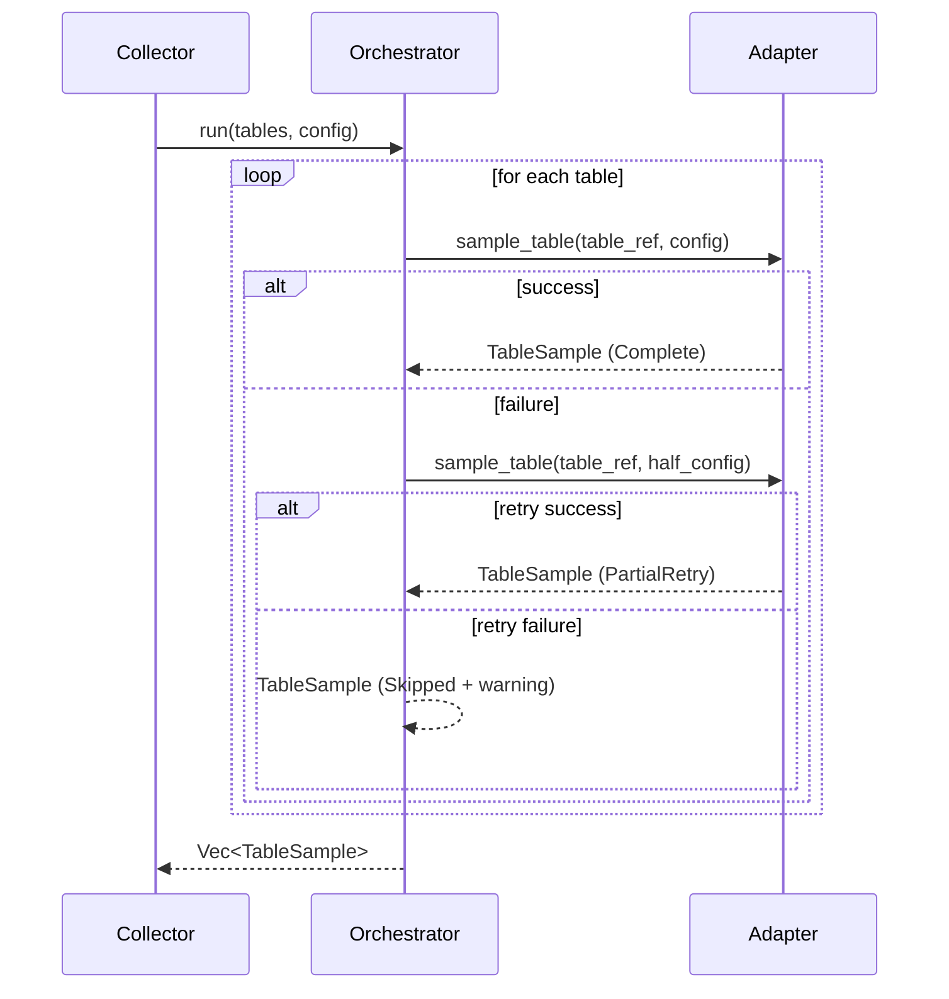

# Implement SamplingOrchestrator in the collector binary

## Context

With `sample_table()` on the trait, the collector binary needs a policy layer that owns the retry-once-with-half-size behavior, random-fallback warnings, and per-table warning propagation. This is the component that makes sampling behavior consistent across all adapters.

**Depends on**: T1 (SampleStatus + sample_table on trait)\
**Specs**: spec:a851bd63-14cc-4ca5-a046-39862bd0e0a7/76c2adac-5a39-4686-b219-3f030de658fc — SamplingOrchestrator section.

## Scope

### In scope

**New: `dbsurveyor-collect/src/sampling.rs`** — `SamplingOrchestrator` struct:

- Accepts a `&dyn DatabaseAdapter` and a `&SamplingConfig`
- For each table, calls `adapter.sample_table(table_ref, config)`
- On failure: retries once with `sample_size / 2`; if still failing, marks `SampleStatus::Skipped` with reason and emits a warning
- On `OrderingStrategy::Unordered` from the adapter: continues with `SamplingStrategy::Random` and appends a warning to `TableSample.warnings`
- Aggregates all per-table warnings into `DatabaseSchema.collection_metadata.warnings` as well (so they are visible in the output file)
- Returns `Vec<TableSample>` with all `SampleStatus` values populated

**`dbsurveyor-collect/src/main.rs`** — wire `SamplingOrchestrator` into the `collect_schema` flow: replace the direct adapter sampling call (currently absent — sampling is not yet wired in) with `SamplingOrchestrator::run()` when `--sample` > 0.

**`--sample 0` sentinel resolution**: In `collect_schema()`, before constructing `SamplingConfig`, resolve `cli.sample == 0` to the default sample size constant (currently `100`). The orchestrator and all adapters must never receive `sample_size = 0`. This is enforced at the CLI argument resolution layer only — no changes needed in `SamplingOrchestrator` or any adapter.

### Out of scope

- Multi-database orchestration (that is T3)
- Any adapter implementation changes

## Acceptance Criteria

- Retry emits `SampleStatus::PartialRetry { original_limit }` with correct `original_limit` value
- Skip emits `SampleStatus::Skipped { reason }` with a non-empty reason string
- Unordered strategy emits a warning in both `TableSample.warnings` and `DatabaseSchema.collection_metadata.warnings`
- A table that succeeds on first attempt has `SampleStatus::Complete`
- Unit tests cover: success path, retry-success path, retry-failure path, and unordered-fallback path (can use mock adapter or SQLite in-memory)
- `--sample 0` path is covered by a collector-level test that verifies resolved `SamplingConfig.sample_size` equals the default sample size (currently 100), and that adapters are never invoked with `sample_size = 0`
