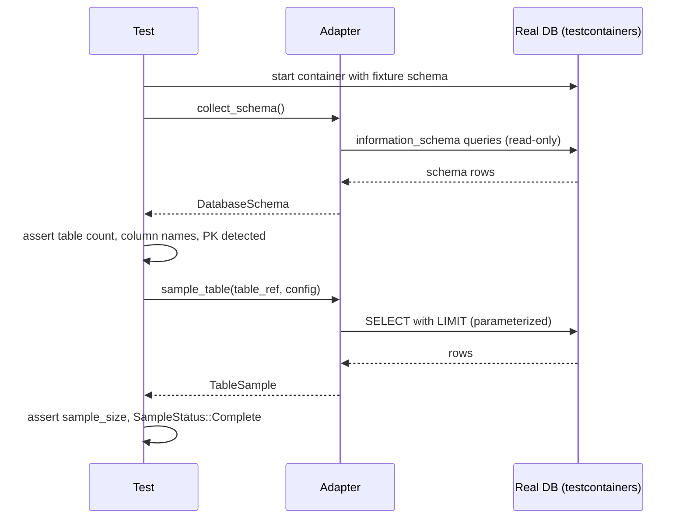

# Implement MySQL, SQLite, and MongoDB adapters with sample_table()

## Context

Adapter stubs already exist for MySQL (`dbsurveyor-core/src/adapters/mysql/`), SQLite (`dbsurveyor-core/src/adapters/sqlite/`), and MongoDB (`dbsurveyor-core/src/adapters/mongodb/`). This ticket upgrades them from stubs/partial implementations to production-ready adapters with schema collection and `sample_table()` — following the same patterns already established by the PostgreSQL adapter.

**Depends on**: T1 (sample_table on trait) **Specs**: spec:a851bd63-14cc-4ca5-a046-39862bd0e0a7/76c2adac-5a39-4686-b219-3f030de658fc — adapter responsibilities; spec:a851bd63-14cc-4ca5-a046-39862bd0e0a7/f257e12b-711f-4d82-9249-e74749688e3c — Core Principles.

## Scope

### MySQL (`dbsurveyor-core/src/adapters/mysql/`)

- `collect_schema()`: tables, columns, PK/FK/unique constraints, indexes, views — using `information_schema`; type mapping to `UnifiedDataType` via `mysql/type_mapping.rs`
- `sample_table()`: ordering strategy — PK if present, timestamp column if present, auto-increment if present, else `Unordered`; parameterized `SELECT` with `LIMIT`; no string concatenation in queries
- `test_connection()`: verify read access with minimal query

### SQLite (`dbsurveyor-core/src/adapters/sqlite/`)

- `collect_schema()`: tables, columns, PKs via `pragma_table_info`, FKs via `pragma_foreign_key_list`, indexes via `pragma_index_list`; type mapping via `sqlite/type_mapping.rs`
- `sample_table()`: ordering by `ROWID` if table has one (standard for non-WITHOUT ROWID tables), else `Unordered`; parameterized query

### MongoDB (`dbsurveyor-core/src/adapters/mongodb/`)

- `collect_schema()`: enumerate collections, sample documents for schema inference (field names + types + occurrence rates), produce `Table` equivalents with `UnifiedDataType::Custom` for BSON types where no clean mapping exists; use existing `mongodb/schema_inference.rs`
- `sample_table()`: order by `_id` (ObjectId provides natural insert order); configurable limit

### All three adapters

- Never log or output credentials in any form
- All queries are read-only (SELECT/DESCRIBE/PRAGMA/aggregate only)
- Each adapter integration-tested with testcontainers (MySQL and MongoDB) or in-memory/temp-file (SQLite) — basic: connect, collect schema, verify table count and column names for a known fixture schema

### Out of scope

- SQL Server / Oracle / MSSQL adapter (separate future work)
- Multi-database enumeration for MySQL (can be a follow-on)

## Acceptance Criteria

- MySQL integration test: fixture schema with 3 tables (one with PK+FK, one with timestamp, one with neither); all three ordering strategies exercised
- SQLite integration test: in-memory DB, same fixture; ROWID ordering verified
- MongoDB integration test: fixture with 2 collections; `_id` ordering verified; field occurrence rates > 0 in schema output
- `cargo clippy --features mysql,sqlite,mongodb -- -D warnings` passes with zero warnings
