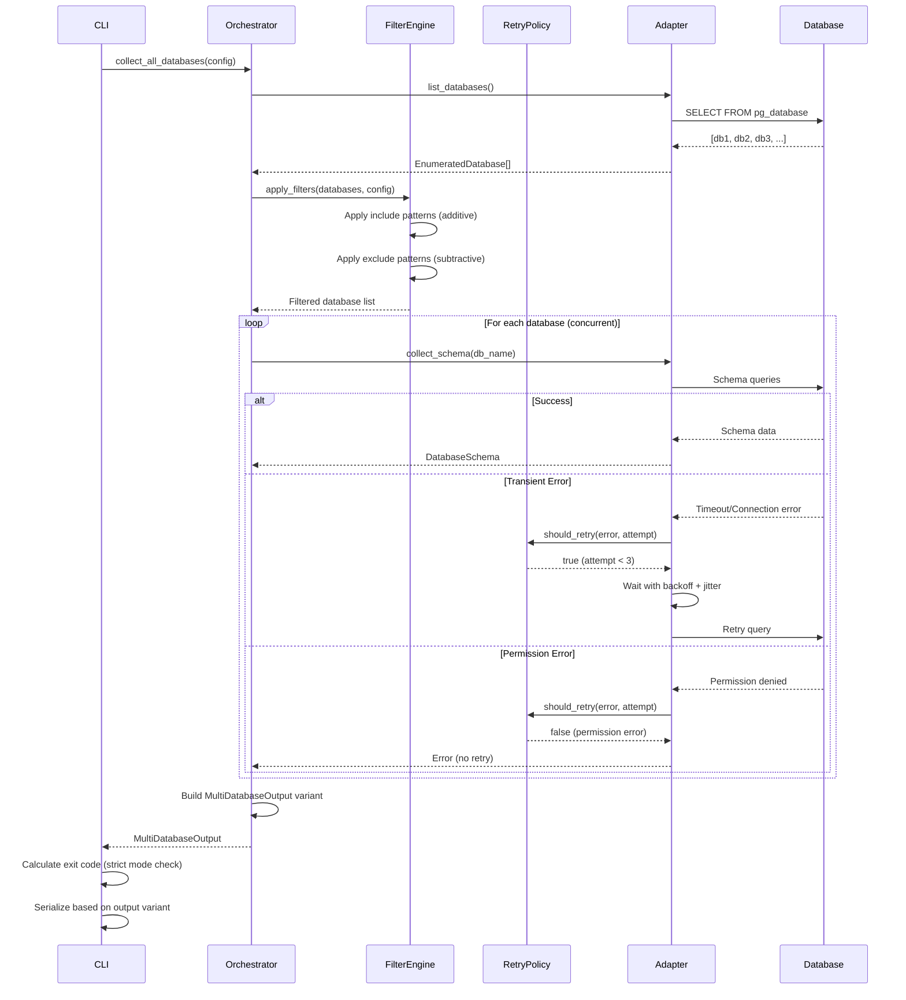
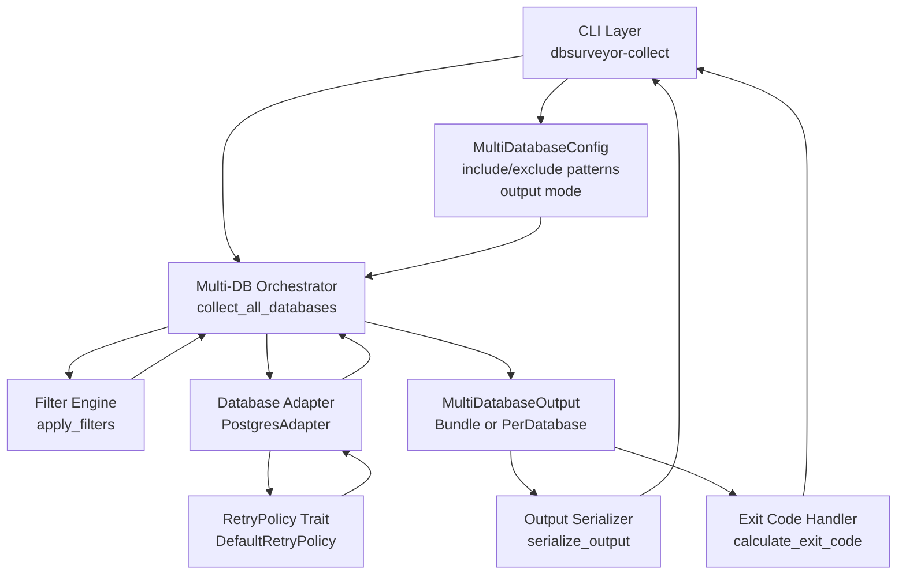
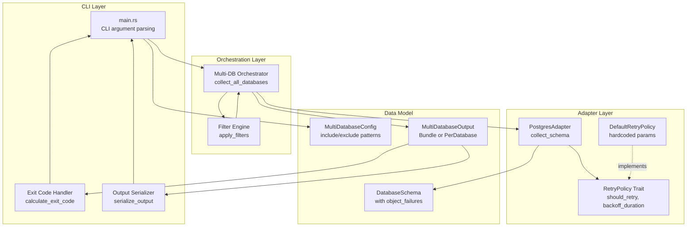

# Tech Plan - Multi-Database Collection and Failure Handling

## Architectural Approach

### Core Design Decisions

**1. Extend Existing Multi-Database Architecture**

The codebase already has a solid foundation for multi-database collection in `file:dbsurveyor-core/src/adapters/config/multi_database.rs` and `file:dbsurveyor-core/src/adapters/postgres/multi_database.rs`. We extend this architecture rather than rebuild it.

**Rationale**: The existing `MultiDatabaseResult`, `DatabaseFailure`, and `MultiDatabaseConfig` structures are well-designed and tested. Extending them is lower risk and faster than redesigning.

**2. Hybrid Failure Tracking Model**

- **Database-level failures**: Tracked in `MultiDatabaseResult.failures` (connection failures, complete database inaccessibility)
- **Object-level failures**: Tracked in `DatabaseSchema.collection_metadata.object_failures` (partial collection where some tables/views failed)

**Rationale**: This hybrid approach allows:
- Complete database failures to be reported separately (no schema data)
- Partial database collections to include both successful objects AND failure details
- Targeted re-runs based on granular failure information
- Postprocessor to distinguish "database failed" from "database partially collected"

**3. RetryPolicy Trait for Flexible Retry Behavior**

Define a `RetryPolicy` trait that adapters implement to determine retry behavior for different error types.

**Rationale**: 
- Allows adapter-specific retry strategies (PostgreSQL vs MySQL may have different transient error patterns)
- Centralizes retry logic in a testable trait
- Keeps orchestration layer clean (delegates retry decisions to adapters)
- Enables future configurability without changing orchestration code

**4. Return Type Variants for Output Modes**

Introduce `MultiDatabaseOutput` enum to represent different output modes:

```rust
pub enum MultiDatabaseOutput {
    Bundle(MultiDatabaseResult),
    PerDatabase {
              manifest: MultiDatabaseManifest,
              /// Includes success schemas and failure stub schemas.
              schemas: Vec<(String, DatabaseSchema)>,
          },
}
```

**Rationale**:
- Type system enforces handling of both output modes
- Orchestrator returns appropriate variant based on configuration
- CLI layer handles serialization based on variant type
- Prevents accidental mismatches between config and output handling

**5. CLI-Level Exit Code Calculation**

Exit code logic lives in the CLI binary (`file:dbsurveyor-collect/src/main.rs`), not in the core library.

**Rationale**:
- Exit codes are a CLI concern, not a data model concern
- Keeps core library focused on data collection and representation
- Simple conditional logic doesn't warrant a separate component
- Easy to test via integration tests

**6. Hardcoded Retry Parameters for v1.0**

Retry parameters (max attempts: 3, base backoff: 500ms, max backoff: 5s, jitter: ±100-300ms) are hardcoded constants.

**Rationale**:
- Meets requirements without adding configuration complexity
- Reduces testing surface for solo developer
- Can be made configurable in v1.1+ if users request it
- Aligns with "quality over speed" by shipping with validated defaults

### Key Constraints

**Security Constraints**:
- All retry logic must preserve credential sanitization
- Failure metadata must never include connection strings or passwords
- Object-level failures must not expose sensitive query details

**Performance Constraints**:
- Retry backoff must have hard cap (5 seconds total) to avoid detection
- Concurrent collection must respect connection pool limits
- Memory usage must remain bounded for large multi-database collections

**Compatibility Constraints**:
- Data model changes must maintain JSON Schema v1.0 compatibility
- Existing single-database collection must remain unchanged
- PostgreSQL implementation serves as reference for MySQL/SQLite adapters

---

## Data Model

### New Data Structures

**1. ObjectFailure - Granular Failure Tracking**

```rust
pub struct ObjectFailure {
    pub object_type: ObjectType,
    pub object_name: String,
    pub schema_name: Option<String>,

    /// Where it failed (operation/stage)
    pub stage: CollectionStage,

    /// Categorized for retry + reporting
    pub error_category: ErrorCategory,
    pub error_message: String,

    /// Retry audit fields (v1.0)
    pub retry_attempts: u32,
    pub final_backoff_ms: Option<u64>,
}

pub enum CollectionStage {
    EnumerateSchemas,
    EnumerateTables,
    CollectColumns,
    CollectConstraints,
    CollectIndexes,
    CollectViews,
    CollectRoutines,
    CollectTriggers,
    Other,
}

pub enum ObjectType {
    Table,
    View,
    Index,
    Constraint,
    Procedure,
    Function,
    Trigger,
    CustomType,
}

pub enum ErrorCategory {
    Permission,
    Timeout,
    NotFound,
    InvalidData,
    Other,
}
```

**Location**: Added to `file:dbsurveyor-core/src/models.rs`

**Integration**: 
- `CollectionMetadata.object_failures: Vec<ObjectFailure>` (new field)
- Allows partial schemas to document which specific objects failed
- Enables targeted re-collection of failed objects

**2. MultiDatabaseOutput - Output Mode Variants**

```rust
pub enum MultiDatabaseOutput {
    Bundle(MultiDatabaseResult),
    PerDatabase {
        manifest: MultiDatabaseManifest,
        /// Includes success schemas and failure stub schemas.
        schemas: Vec<(String, DatabaseSchema)>,
    },
}
```

**Location**: Added to `file:dbsurveyor-core/src/adapters/config/multi_database.rs`

**Integration**:
- Orchestration layer returns this enum based on configuration
- CLI layer pattern-matches to determine serialization strategy
- Type-safe handling of both output modes
- Directory output writes a `MultiDatabaseManifest` plus per-db schema files for successes and per-db failure stub schema files for failures

**3. RetryPolicy Trait - Retry Decision Logic**

```rust
pub trait RetryPolicy {
    fn should_retry(&self, category: ErrorCategory, attempt: u32) -> bool;
    fn backoff_duration(&self, attempt: u32) -> Duration;
}

pub struct DefaultRetryPolicy {
    max_attempts: u32,
    base_backoff_ms: u64,
    max_backoff_ms: u64,
}
```

**Location**: Added to `file:dbsurveyor-core/src/adapters/mod.rs` or new `file:dbsurveyor-core/src/adapters/retry.rs`

**Integration**:
- Adapters implement or use `DefaultRetryPolicy`
- Orchestration layer calls `should_retry()` to determine retry behavior
- Hardcoded constants for v1.0: `max_attempts: 3`, `base_backoff_ms: 500`, `max_backoff_ms: 5000`

### Extended Data Structures

**1. MultiDatabaseConfig Extensions**

```rust
pub struct MultiDatabaseConfig {
    // Existing fields
    pub max_concurrency: usize,
    pub include_system: bool,
    pub exclude_patterns: Vec<String>,
    pub continue_on_error: bool,
    
    // NEW fields
    pub include_patterns: Vec<String>,
    pub output_mode: OutputMode,
}

pub enum OutputMode {
    SingleBundle,
    OnePerDatabase,
}
```

**Changes**:
- Add `include_patterns` for additive filtering
- Add `output_mode` to control return type variant

**2. CollectionMetadata Extensions**

```rust
pub struct CollectionMetadata {
    // Existing fields
    pub collected_at: DateTime<Utc>,
    pub collection_duration_ms: u64,
    pub collector_version: String,
    pub warnings: Vec<String>,
    
    // NEW field
    #[serde(default)]
    pub object_failures: Vec<ObjectFailure>,
}
```

**Changes**:
- Add `object_failures` for granular failure tracking
- Preserves existing `warnings` for human-readable summaries

### Data Flow for Multi-Database Collection



---

## Component Architecture

### 1. Filter Engine Component

**Responsibility**: Apply include/exclude glob patterns to database lists.

**Interface**:
```rust
pub fn apply_filters(
    databases: &[EnumeratedDatabase],
    include_patterns: &[String],
    exclude_patterns: &[String],
) -> Vec<EnumeratedDatabase>
```

**Behavior**:
1. Start with empty result set
2. If `include_patterns` is non-empty: add databases matching any include pattern
3. If `include_patterns` is empty: add all databases (default to all)
4. Remove databases matching any exclude pattern
5. Return filtered list

**Integration**: Called by `collect_all_databases()` orchestrator before collection begins.

**Location**: `file:dbsurveyor-core/src/adapters/postgres/multi_database.rs` (extend existing `filter_databases()`)

### 2. RetryPolicy Trait and Default Implementation

**Responsibility**: Determine whether to retry an operation based on error type and attempt count.

**Interface**:
```rust
pub trait RetryPolicy: Send + Sync {
    fn should_retry(&self, category: ErrorCategory, attempt: u32) -> bool;
    fn backoff_duration(&self, attempt: u32) -> Duration;
}

pub struct DefaultRetryPolicy;
```

**Behavior**:
- `should_retry()`: Returns `true` for transient errors (timeout, connection) if `attempt < 3`; `false` for permission/authorization errors
- `backoff_duration()`: Returns `min(500ms * 2^attempt + jitter, 5000ms)` where jitter is random ±100-300ms

**Integration**: 
- Adapters use `DefaultRetryPolicy` when executing database operations
- Orchestrator passes retry policy to adapter methods
- Future: Allow custom retry policies via configuration

**Location**: New file `file:dbsurveyor-core/src/adapters/retry.rs`

### 3. Multi-Database Orchestrator Extensions

**Responsibility**: Coordinate multi-database collection with filtering, retry, and failure tracking.

**Current Implementation**: `file:dbsurveyor-core/src/adapters/postgres/multi_database.rs::collect_all_databases()`

**Extensions Needed**:
1. Call filter engine with both include and exclude patterns
2. Pass retry policy to database collection operations
3. Collect object-level failures from partial schemas
4. Build appropriate `MultiDatabaseOutput` variant based on config
5. Aggregate all failure metadata (database-level + object-level)

**Integration Points**:
- Receives `MultiDatabaseConfig` with include/exclude patterns and output mode
- Returns `MultiDatabaseOutput` enum variant
- Logs progress based on verbosity level
- Respects `continue_on_error` flag

### 4. CLI Exit Code Handler

**Responsibility**: Calculate appropriate exit code based on collection results and strict mode.

**Interface**:
```rust
fn calculate_exit_code(output: &MultiDatabaseOutput, strict: bool) -> i32
```

**Behavior**:
- **Default mode** (`strict = false`): Exit 0 if at least one selected database produced a usable schema; exit 1 only if none did
- **Strict mode** (`strict = true`): Exit 1 if any selected database failed at the database level, OR if any database has `object_failures` that include Tables (views/routines/triggers remain warnings)

**Integration**: Called in `file:dbsurveyor-collect/src/main.rs` after multi-database collection completes.

**Location**: `file:dbsurveyor-collect/src/main.rs` (helper function)

### 5. Output Serializer

**Responsibility**: Serialize `MultiDatabaseOutput` variants to appropriate file formats.

**Interface**:
```rust
async fn serialize_output(
    output: MultiDatabaseOutput,
    output_path: &Path,
    output_dir: Option<&Path>,
) -> Result<()>
```

**Behavior**:
- **Bundle variant**: Serialize `MultiDatabaseResult` to single JSON file
- **PerDatabase variant**: Write a manifest file + per-db schema files for successes + per-db failure stub schema files for failed databases

**Integration**: Called in `file:dbsurveyor-collect/src/main.rs` after collection completes.

**Location**: `file:dbsurveyor-collect/src/main.rs` (helper function) or new module `file:dbsurveyor-collect/src/output.rs`

### Component Interaction Flow



### Integration with Existing Architecture

**Existing Components (Unchanged)**:
- `DatabaseAdapter` trait - core interface for all database adapters
- `DatabaseSchema` - single database schema representation
- `CollectionMetadata` - metadata about collection process (extended with `object_failures`)
- `DatabaseInfo` - database information with `access_level` and `collection_status`

**Extended Components**:
- `MultiDatabaseConfig` - add `include_patterns` and `output_mode` fields
- `CollectionMetadata` - add `object_failures` field
- `MultiDatabaseResult` - unchanged, but used in new `MultiDatabaseOutput::Bundle` variant

**New Components**:
- `ObjectFailure` - granular failure tracking
- `RetryPolicy` trait - retry decision logic
- `MultiDatabaseOutput` enum - output mode variants
- Filter engine - include/exclude pattern application
- Exit code handler - automation-friendly exit codes

### Key Trade-offs

**Trade-off 1: Hybrid Failure Model vs Single Location**
- **Chosen**: Hybrid (DB failures in `MultiDatabaseResult`, object failures in `DatabaseSchema`)
- **Alternative**: All failures in one location
- **Rationale**: Hybrid allows partial schemas to be useful while maintaining clear separation between "database failed" and "object failed"

**Trade-off 2: RetryPolicy Trait vs Hardcoded Logic**
- **Chosen**: RetryPolicy trait with hardcoded parameters
- **Alternative**: Simple hardcoded retry logic in orchestrator
- **Rationale**: Trait provides flexibility for future adapter-specific policies while keeping v1.0 simple with hardcoded defaults

**Trade-off 3: Return Type Variants vs Config-Driven Serialization**
- **Chosen**: `MultiDatabaseOutput` enum variants
- **Alternative**: Always return `MultiDatabaseResult`, CLI decides serialization
- **Rationale**: Type safety prevents mismatches; orchestrator controls output structure based on config

**Trade-off 4: Additive Include vs Whitelist Include**
- **Chosen**: Additive (start empty, add matches)
- **Alternative**: Whitelist (start full, filter to matches)
- **Rationale**: Additive is more explicit and predictable; empty include = all databases (intuitive default)

---

## Data Model

### Schema Extensions

**1. CollectionMetadata - Add Object Failures**

```rust
pub struct CollectionMetadata {
    pub collected_at: DateTime<Utc>,
    pub collection_duration_ms: u64,
    pub collector_version: String,
    pub warnings: Vec<String>,
    pub object_failures: Vec<ObjectFailure>,  // NEW
}
```

**Impact**: 
- Backward compatible (new field is optional in JSON)
- Allows partial schemas to document granular failures
- Postprocessor can display "collected 45/50 tables, 5 failed"

**2. ObjectFailure - New Structure**

```rust
pub struct ObjectFailure {
    pub object_type: ObjectType,
    pub object_name: String,
    pub schema_name: Option<String>,

    /// Where it failed (operation/stage)
    pub stage: CollectionStage,

    /// Categorized for retry + reporting
    pub error_category: ErrorCategory,
    pub error_message: String,

    /// Retry audit fields (v1.0)
    pub retry_attempts: u32,
    pub final_backoff_ms: Option<u64>,
}

pub enum ObjectType {
    Table, View, Index, Constraint, 
    Procedure, Function, Trigger, CustomType,
}

pub enum ErrorCategory {
    Permission,      // Access denied
    Timeout,         // Query timeout
    NotFound,        // Object disappeared during collection
    InvalidData,     // Data parsing error
    Other,           // Uncategorized
}
```

**Purpose**:
- Enables targeted re-runs (e.g., "re-collect only failed tables")
- Supports automation (scripts can parse failures and retry)
- Provides audit trail for compliance workflows

**3. MultiDatabaseConfig - Add Include Patterns and Output Mode**

```rust
pub struct MultiDatabaseConfig {
    pub max_concurrency: usize,
    pub include_system: bool,
    pub exclude_patterns: Vec<String>,
    pub include_patterns: Vec<String>,  // NEW
    pub output_mode: OutputMode,        // NEW
    pub continue_on_error: bool,
}

pub enum OutputMode {
    SingleBundle,
    OnePerDatabase,
}
```

**Impact**:
- `include_patterns`: Empty = all databases; non-empty = only matching databases
- `output_mode`: Determines return type variant from orchestrator
- Backward compatible (new fields have sensible defaults)

**4. MultiDatabaseOutput - New Enum**

```rust
pub enum MultiDatabaseOutput {
    Bundle(MultiDatabaseResult),
    PerDatabase {
              manifest: MultiDatabaseManifest,
              /// Includes success schemas and failure stub schemas.
              schemas: Vec<(String, DatabaseSchema)>,
          },
}
```

**Purpose**:
- Type-safe representation of output modes
- Forces CLI to handle both cases explicitly
- Simplifies serialization logic

### Relationship with Existing Models

**DatabaseSchema** (existing, extended):
- `collection_metadata.object_failures` added
- Represents single database (used in both single-DB and multi-DB modes)
- Can now represent partial collections with failure details

**MultiDatabaseResult** (existing, unchanged):
- Contains `Vec<DatabaseCollectionResult>` (successes)
- Contains `Vec<DatabaseFailure>` (database-level failures)
- Wrapped in `MultiDatabaseOutput::Bundle` variant

**DatabaseServerSchema** (existing, may be deprecated):
- Currently defined but not used in PostgreSQL implementation
- May be superseded by `MultiDatabaseOutput::Bundle(MultiDatabaseResult)`
- Decision: Keep for backward compatibility or remove in favor of `MultiDatabaseOutput`?

### JSON Schema Impact

**New Fields in v1.0 Schema**:
- `CollectionMetadata.object_failures` (optional array)
- `ObjectFailure` structure definition
- `MultiDatabaseConfig.include_patterns` (optional array)
- `MultiDatabaseConfig.output_mode` (optional enum)

**Backward Compatibility**:
- All new fields are optional
- Existing v1.0 files remain valid
- Postprocessor must handle missing fields gracefully

---

## Component Architecture

### Component Overview



### 1. Filter Engine

**Responsibility**: Apply include/exclude glob patterns to database lists.

**Key Methods**:
- `apply_filters(databases, include, exclude) -> Vec<EnumeratedDatabase>`
- `matches_pattern(name, pattern) -> bool` (existing glob_match)

**Logic**:
1. If `include_patterns` is empty: start with all databases
2. If `include_patterns` is non-empty: start with empty set, add databases matching any include pattern
3. Remove databases matching any exclude pattern
4. Return filtered list

**Error Handling**: No errors; invalid patterns are logged as warnings.

**Testing**: Unit tests for pattern combinations, edge cases (empty patterns, conflicting patterns).

### 2. RetryPolicy Trait and Implementation

**Responsibility**: Determine retry behavior for failed operations.

**Trait Definition**:
```rust
pub trait RetryPolicy: Send + Sync {
    fn should_retry(&self, category: ErrorCategory, attempt: u32) -> bool;
    fn backoff_duration(&self, attempt: u32) -> Duration;
}
```

**DefaultRetryPolicy Implementation**:
- Hardcoded constants: `MAX_ATTEMPTS = 3`, `BASE_BACKOFF_MS = 500`, `MAX_BACKOFF_MS = 5000`
- `should_retry()`: Returns `true` for `ConnectionTimeout`, `Connection`, `QueryExecution` errors if `attempt < MAX_ATTEMPTS`; `false` for `InsufficientPrivileges`, `Configuration` errors
- `backoff_duration()`: Returns `min(BASE_BACKOFF_MS * 2^attempt + random_jitter(), MAX_BACKOFF_MS)`

**Integration**: Adapters call `retry_policy.should_retry()` when operations fail; orchestrator provides policy instance.

### 3. Multi-Database Orchestrator Extensions

**Current**: `file:dbsurveyor-core/src/adapters/postgres/multi_database.rs::collect_all_databases()`

**Extensions**:
1. **Filter with Include Patterns**: Call extended filter engine with both include and exclude
2. **Retry Integration**: Pass `RetryPolicy` to adapter operations; wrap collection calls with retry logic
3. **Object Failure Aggregation**: Collect `object_failures` from each `DatabaseSchema.collection_metadata`
4. **Output Variant Selection**: Build `MultiDatabaseOutput::Bundle` or `MultiDatabaseOutput::PerDatabase` based on `config.output_mode`

**Signature Change**:
```rust
pub async fn collect_all_databases(
    adapter: &PostgresAdapter,
    config: &MultiDatabaseConfig,
) -> Result<MultiDatabaseOutput>  // Changed from MultiDatabaseResult
```

**Integration**: Called by CLI; returns variant that CLI serializes appropriately.

### 4. CLI Exit Code Handler

**Responsibility**: Calculate exit code based on collection results and strict mode.

**Implementation**:
```rust
fn calculate_exit_code(output: &MultiDatabaseOutput, strict: bool) -> i32 {
    match output {
        MultiDatabaseOutput::Bundle(result) => {
            if strict {
                if result.failures.is_empty() { 0 } else { 1 }
            } else {
                if result.databases.is_empty() { 1 } else { 0 }
            }
        }
        MultiDatabaseOutput::PerDatabase { schemas, .. } => {
            if strict {
                // Check if any database has object failures
                let has_failures = schemas.iter()
                    .any(|(_, schema)| {
                                          schema
                                              .collection_metadata
                                              .object_failures
                                              .iter()
                                              .any(|f| matches!(f.object_type, ObjectType::Table))
                                      });
                if has_failures { 1 } else { 0 }
            } else {
                let any_success = schemas.iter().any(|(_, s)| matches!(s.database_info.collection_status, CollectionStatus::Success));
                                  if any_success { 0 } else { 1 }
            }
        }
    }
}
```

**Integration**: Called in `main()` after collection; result passed to `std::process::exit()`.

**Location**: `file:dbsurveyor-collect/src/main.rs`

### 5. Output Serializer

**Responsibility**: Serialize `MultiDatabaseOutput` variants to files.

**Implementation**:
```rust
async fn serialize_output(
    output: MultiDatabaseOutput,
    output_path: &Path,
    output_dir: Option<&Path>,
    cli: &Cli,
) -> Result<()>
```

**Behavior**:
- **Bundle variant**: Serialize `MultiDatabaseResult` to single file (with optional compression/encryption)
- **PerDatabase variant**:
    - Write a manifest file in the output directory
    - Write per-db schema files for successes
    - Write per-db failure stub schema files for failed databases (status=Failed + error summary)
    - Apply compression/encryption consistently per file

**Integration**: Called in `main()` after collection; handles compression and encryption based on CLI flags.

**Location**: `file:dbsurveyor-collect/src/main.rs` or new `file:dbsurveyor-collect/src/output.rs`

### Adapter Integration Pattern

**Existing Adapters** (PostgresAdapter, MySqlAdapter, SqliteAdapter):
- Implement `DatabaseAdapter` trait (unchanged)
- Use `RetryPolicy` when executing queries
- Populate `object_failures` in `CollectionMetadata` when partial collection occurs
- Return `DatabaseSchema` with complete metadata

**Multi-Database Support**:
- PostgreSQL: Extend existing `collect_all_databases()` with new features
- MySQL: Implement similar multi-database orchestration (future)
- SQLite: Not applicable (single-file databases)
- MongoDB: Implement multi-database support (future)

### Security Considerations

**Credential Protection**:
- Retry logic must not log connection strings
- Object failures must not include sensitive query details
- Filter patterns must not expose database naming conventions in logs

**Resource Management**:
- Retry backoff prevents resource exhaustion
- Connection pool limits prevent overwhelming database server
- Concurrent collection respects `max_concurrency` limits

**Audit Trail**:
- All failures recorded with timestamps and error categories
- Retry attempts logged at debug level only
- Success/failure counts in collection metadata for compliance
