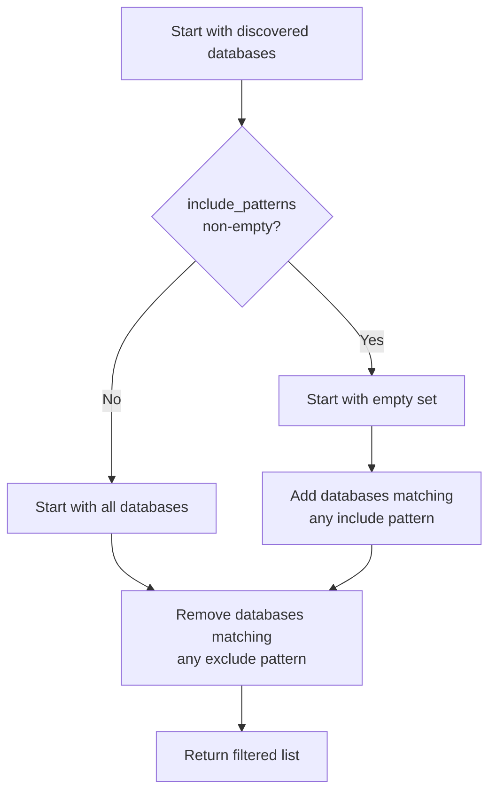

# Extend Multi-Database Config and Filter Engine with Include Patterns

## Overview

Add include pattern support to multi-database filtering with additive semantics (pg_dump-like behavior). This enables precise database selection for targeted collection workflows.

## Scope

**What's Included**:
- Extend `MultiDatabaseConfig` in `file:dbsurveyor-core/src/adapters/config/multi_database.rs`:
  - Add `include_patterns: Vec<String>` field
  - Update builder method: `with_include_patterns(patterns: Vec<String>)`
- Update `filter_databases()` in `file:dbsurveyor-core/src/adapters/postgres/multi_database.rs`:
  - If `include_patterns` is empty: start with all databases (current behavior)
  - If `include_patterns` is non-empty: start with empty set, add databases matching any include pattern
  - Remove databases matching any exclude pattern (existing logic)
  - Reuse existing `glob_match()` function for pattern matching
- CLI argument parsing in `file:dbsurveyor-collect/src/main.rs`:
  - Add `--include-databases <PATTERNS>` flag (comma-separated glob patterns)
  - Parse into `Vec<String>` and pass to `MultiDatabaseConfig`
- Unit tests for filter combinations:
  - Include only (no exclude)
  - Exclude only (no include) - existing behavior
  - Both include and exclude (include first, then exclude)
  - Empty patterns (should include all databases)
  - Conflicting patterns (exclude wins)
- Integration tests with real PostgreSQL database enumeration

**What's Explicitly Out**:
- Schema-level or table-level filtering (deferred to future)
- Regex patterns (only glob patterns `*` and `?` for v1.0)
- Interactive database selection (flag-driven only)

## Filter Logic

## Acceptance Criteria

- [ ] `MultiDatabaseConfig.include_patterns` field exists and serializes correctly
- [ ] `--include-databases "app_*,analytics_*"` correctly filters database list
- [ ] Include + exclude patterns work together (include first, then exclude)
- [ ] Empty include patterns default to all databases (backward compatible)
- [ ] Unit tests cover all pattern combination scenarios
- [ ] Integration test verifies filtering against real PostgreSQL server with 10+ databases
- [ ] Glob patterns `*` and `?` work correctly (reuse existing `glob_match()` tests)

## References

- **Spec**: `spec:de2eeeb8-bfeb-4a11-98aa-84efc70568b2/820ca524-8c7d-4939-8097-f1158e7d67ea` (Tech Plan - Filter Engine Component)
- **Core Flows**: `spec:de2eeeb8-bfeb-4a11-98aa-84efc70568b2/661dbe3d-b679-4287-991e-26f4a0dd98b9` (Flow 2 - flag-driven filtering)
- **Epic Brief**: `spec:de2eeeb8-bfeb-4a11-98aa-84efc70568b2/64fc1d47-e1e3-40db-a5dc-8dc9c248814c` (v1.0 Must Have - flag-driven filters with glob support)