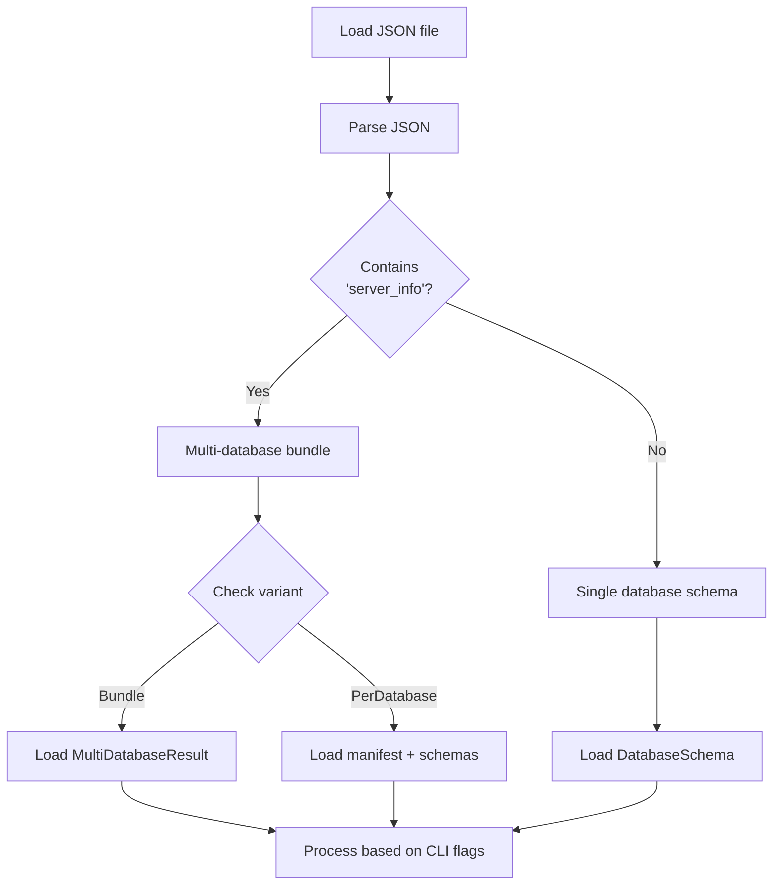

# Implement Postprocessor Multi-Database Bundle Support

## Overview

Add support for processing multi-database bundles in the postprocessor. Enable the `generate`, `analyze`, `sql`, and `validate` commands to handle both single-database and multi-database inputs.

## Scope

**What's Included**:

- Extend `load_schema()` in `file:dbsurveyor/src/main.rs` to detect and handle multi-database bundles:
  - Detect `MultiDatabaseResult` vs `DatabaseSchema` in JSON
  - Parse `MultiDatabaseOutput::Bundle` variant
  - Parse `MultiDatabaseOutput::PerDatabase` variant (manifest + schemas)
- Add CLI flags for multi-database processing:
  - `--combined`: Generate single combined report for all databases
  - `--split`: Generate per-database reports in output directory
  - `--database <NAME>`: Process only specific database from bundle
- Update `generate_documentation()` to handle multi-database inputs:
  - Combined mode: Generate single Markdown with per-database sections
  - Split mode: Generate separate Markdown files per database
  - Single-database mode: Extract specific database from bundle
- Update `analyze_schema()` to handle multi-database inputs:
  - Show server-level statistics
  - Show per-database statistics
  - Show aggregate statistics (total tables across all databases)
- Update `generate_sql()` to handle multi-database inputs:
  - Combined mode: Generate single SQL file with per-database sections
  - Split mode: Generate separate SQL files per database
- Update `validate_schema()` to handle multi-database inputs:
  - Validate manifest structure
  - Validate each database schema
  - Report failures from `MultiDatabaseResult.failures`
  - Report object failures from each database
- Add unit tests for multi-database input detection and parsing
- Add integration tests for all commands with multi-database bundles

**What's Explicitly Out**:

- Cross-database analysis (foreign keys across databases, schema comparison) (deferred to post-v1.0)
- Visual diagrams (Mermaid ERD) for multi-database bundles (deferred)
- HTML reports for multi-database bundles (deferred)

## Multi-Database Input Detection

## Acceptance Criteria

- [ ] `load_schema()` correctly detects and parses multi-database bundles
- [ ] `--combined` flag generates single report with all databases
- [ ] `--split` flag generates per-database reports in output directory
- [ ] `--database <NAME>` flag extracts and processes specific database
- [ ] `generate` command works with multi-database bundles (Markdown output)
- [ ] `analyze` command shows server-level and per-database statistics
- [ ] `sql` command generates DDL for multi-database bundles
- [ ] `validate` command validates multi-database bundles and reports failures
- [ ] Unit tests verify multi-database input detection and parsing
- [ ] Integration tests verify all commands with multi-database bundles
- [ ] Error messages clearly indicate when multi-database features are used

## References

- **Spec**: `spec:de2eeeb8-bfeb-4a11-98aa-84efc70568b2/820ca524-8c7d-4939-8097-f1158e7d67ea` (Tech Plan - MultiDatabaseOutput)
- **Core Flows**: `spec:de2eeeb8-bfeb-4a11-98aa-84efc70568b2/661dbe3d-b679-4287-991e-26f4a0dd98b9` (Flow 3 - batch documentation)
- **Epic Brief**: `spec:de2eeeb8-bfeb-4a11-98aa-84efc70568b2/64fc1d47-e1e3-40db-a5dc-8dc9c248814c` (v1.0 Must Have - postprocessor)
- **Related Tickets**:
  - `ticket:de2eeeb8-bfeb-4a11-98aa-84efc70568b2/f609d694-2c7e-4e8d-9542-020dad45750b` (MultiDatabaseOutput variants)
