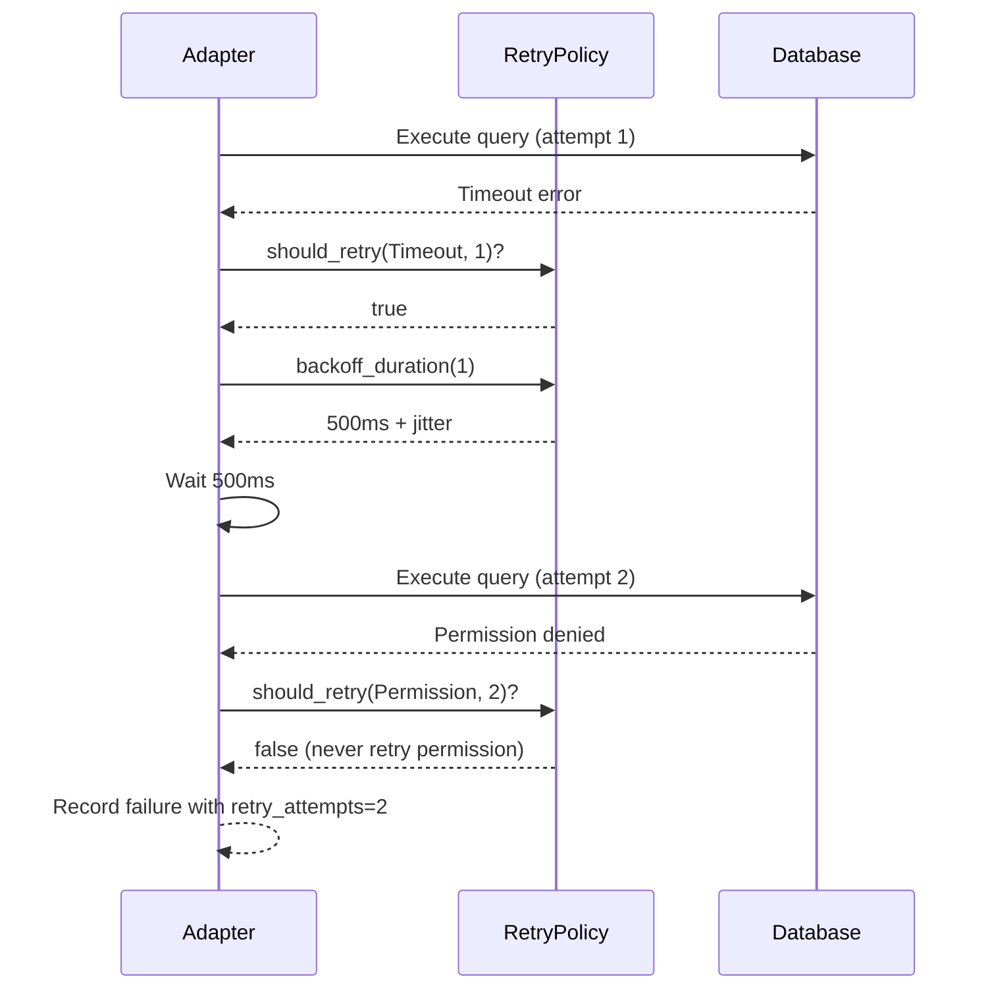

# Implement RetryPolicy Trait and DefaultRetryPolicy

## Overview

Create retry policy abstraction with hardcoded v1.0 defaults for per-query retry behavior. This enables transient error recovery while avoiding retry storms on permission errors.

## Scope

**What's Included**:
- Define `RetryPolicy` trait in new file `file:dbsurveyor-core/src/adapters/retry.rs`:
  - `should_retry(&self, category: ErrorCategory, attempt: u32) -> bool`
  - `backoff_duration(&self, attempt: u32) -> Duration`
  - Trait must be `Send + Sync` for async compatibility
- Implement `DefaultRetryPolicy` with hardcoded constants:
  - `MAX_ATTEMPTS = 3`
  - `BASE_BACKOFF_MS = 500`
  - `MAX_BACKOFF_MS = 5000`
  - Jitter: random ±100-300ms using `rand` crate
- Retry decision logic:
  - Return `true` for `ErrorCategory::Timeout`, `ErrorCategory::Connection`, `ErrorCategory::Other` if `attempt < MAX_ATTEMPTS`
  - Return `false` for `ErrorCategory::Permission`, `ErrorCategory::NotFound` (never retry)
- Exponential backoff calculation: `min(BASE_BACKOFF_MS * 2^attempt + random_jitter(), MAX_BACKOFF_MS)`
- Unit tests for retry decision logic covering all error categories
- Unit tests for backoff calculation (verify exponential growth and cap)
- Re-export from `file:dbsurveyor-core/src/adapters/mod.rs`

**What's Explicitly Out**:
- Configurable retry parameters (deferred to v1.1+)
- Adapter-specific retry policies (use `DefaultRetryPolicy` for all adapters in v1.0)
- Actual integration into adapter query execution (handled in `ticket:de2eeeb8-bfeb-4a11-98aa-84efc70568b2/6`)

## Retry Logic Flow

## Acceptance Criteria

- [ ] `RetryPolicy` trait compiles and is `Send + Sync`
- [ ] `DefaultRetryPolicy` returns correct retry decisions for all `ErrorCategory` variants
- [ ] Permission errors (`ErrorCategory::Permission`) are never retried
- [ ] Transient errors (Timeout, Connection) are retried up to 3 attempts
- [ ] Backoff duration respects max cap (5000ms) and includes jitter
- [ ] Unit tests cover edge cases: attempt 0, max attempts reached, all error categories
- [ ] Jitter is random and within ±100-300ms range (verified statistically in tests)

## References

- **Spec**: `spec:de2eeeb8-bfeb-4a11-98aa-84efc70568b2/820ca524-8c7d-4939-8097-f1158e7d67ea` (Tech Plan - RetryPolicy Trait section)
- **Core Flows**: `spec:de2eeeb8-bfeb-4a11-98aa-84efc70568b2/661dbe3d-b679-4287-991e-26f4a0dd98b9` (Flow 6 - retry transient errors)