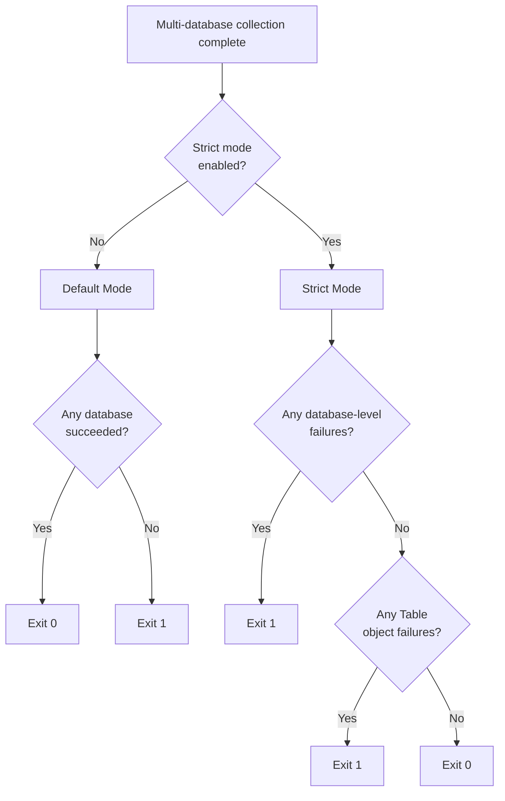

# Implement Strict Exit Code Semantics and CLI Integration

## Overview

Add automation-friendly exit code calculation with configurable strict mode. This enables CI/CD pipelines to correctly interpret partial collection success/failure.

## Scope

**What's Included**:
- Implement `calculate_exit_code()` function in `file:dbsurveyor-collect/src/main.rs`:
  - **Default mode** (`strict = false`): Exit 0 if at least one database succeeded; exit 1 if all failed
  - **Strict mode** (`strict = true`): Exit 1 if any database-level failure OR any `object_failures` include Tables
  - Views/routines/triggers remain warnings (don't fail strict mode)
- Exit code logic for both `MultiDatabaseOutput` variants:
  - `Bundle`: Check `MultiDatabaseResult.failures` and aggregate `object_failures` from all schemas
  - `PerDatabase`: Check manifest status and `object_failures` in each schema
- CLI argument parsing:
  - Add `--strict` flag (boolean, default false)
- Update `main()` to call `calculate_exit_code()` and `std::process::exit()`
- Unit tests for exit code calculation logic covering all scenarios:
  - All databases succeed (exit 0 in both modes)
  - Some databases fail (exit 0 default, exit 1 strict)
  - All databases fail (exit 1 in both modes)
  - Object failures with Tables (exit 0 default, exit 1 strict)
  - Object failures with only views/routines (exit 0 in both modes)
- Integration tests verifying exit codes in CI/CD scenarios

**What's Explicitly Out**:
- Custom exit code configuration (hardcoded 0/1 for v1.0)
- Exit code documentation in postprocessor (separate work)
- Logging of exit code rationale (use verbose mode for debugging)

## Exit Code Decision Tree

## Acceptance Criteria

- [ ] Default mode exits 0 when at least one database succeeds
- [ ] Default mode exits 1 only when all databases fail
- [ ] Strict mode exits 1 on any database-level failure
- [ ] Strict mode exits 1 on any Table object failures
- [ ] Strict mode exits 0 when only view/routine/trigger failures exist
- [ ] `--strict` flag correctly toggles behavior
- [ ] Unit tests cover all exit code scenarios for both output variants
- [ ] Integration tests verify exit codes in automated workflows (CI/CD simulation)
- [ ] Exit code is set before any cleanup/logging to ensure correct process exit

## References

- **Spec**: `spec:de2eeeb8-bfeb-4a11-98aa-84efc70568b2/820ca524-8c7d-4939-8097-f1158e7d67ea` (Tech Plan - CLI Exit Code Handler)
- **Core Flows**: `spec:de2eeeb8-bfeb-4a11-98aa-84efc70568b2/661dbe3d-b679-4287-991e-26f4a0dd98b9` (Flow 6 - automation-friendly exit codes)
- **Epic Brief**: `spec:de2eeeb8-bfeb-4a11-98aa-84efc70568b2/64fc1d47-e1e3-40db-a5dc-8dc9c248814c` (v1.0 Must Have - automation-friendly exit codes)