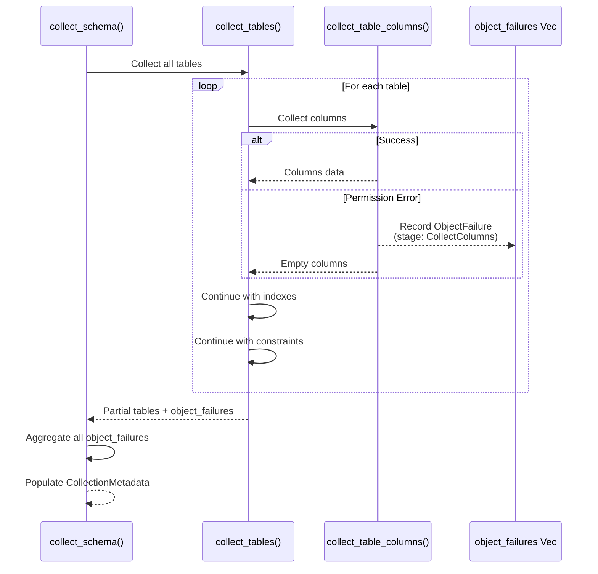

# Refactor PostgreSQL Schema Collection for Graceful Degradation

## Overview

Update PostgreSQL schema collection to populate ObjectFailure metadata instead of failing fast. This enables partial schema collection with detailed failure tracking for targeted re-runs.

## Scope

**What's Included**:

- Refactor `collect_tables()` in `file:dbsurveyor-core/src/adapters/postgres/schema_collection.rs`:
  - Wrap each table's sub-collection (columns, indexes, constraints, foreign keys) in error handling
  - On failure, record `ObjectFailure` with appropriate `stage` (CollectColumns, CollectIndexes, etc.)
  - Continue collecting remaining tables instead of returning early
  - Return partial table data when possible (e.g., if columns succeed but indexes fail)
- Refactor sub-collection methods to support partial collection:
  - `collect_table_columns()`: On failure, record `ObjectFailure` with `stage: CollectColumns`, `object_type: Table`
  - `collect_table_indexes()`: On failure, record `ObjectFailure` with `stage: CollectIndexes`, `object_type: Table`
  - `collect_table_constraints()`: On failure, record `ObjectFailure` with `stage: CollectConstraints`, `object_type: Table`
  - `collect_table_primary_key()`: On failure, record `ObjectFailure` with `stage: CollectConstraints`, `object_type: Table`
  - `collect_table_foreign_keys()`: On failure, record `ObjectFailure` with `stage: CollectConstraints`, `object_type: Table`
- Update `collect_schema()` to aggregate object failures:
  - Collect `object_failures` from all collection stages
  - Populate `CollectionMetadata.object_failures` with all recorded failures
  - Preserve existing warnings for views/routines/triggers
- Populate retry audit fields in `ObjectFailure`:
  - Extract `retry_attempts` from retry wrapper context
  - Extract `final_backoff_ms` from last retry attempt
- Update existing integration tests to verify partial collection behavior
- Add new integration tests for object-level failure scenarios:
  - Simulate permission error on specific table (verify partial collection)
  - Simulate timeout on index collection (verify table collected without indexes)

**What's Explicitly Out**:

- Changes to views/routines/triggers collection (already gracefully degrade with warnings)
- MySQL/SQLite adapter changes (separate work)
- Postprocessor display of object failures (future work)

## Graceful Degradation Flow

## Acceptance Criteria

- [ ] Table collection continues when individual table sub-collections fail
- [ ] `ObjectFailure` entries include all required fields: object_type, object_name, schema_name, stage, error_category, error_message, retry_attempts, final_backoff_ms
- [ ] Partial table data is included when columns succeed but indexes fail
- [ ] `CollectionMetadata.object_failures` contains all recorded failures from all stages
- [ ] Retry audit fields (`retry_attempts`, `final_backoff_ms`) are populated from retry wrapper context
- [ ] Integration test verifies partial collection with simulated permission errors on specific tables
- [ ] Integration test verifies table collected without indexes when index collection fails
- [ ] Strict mode exit code logic correctly identifies Table object failures (verified in `ticket:de2eeeb8-bfeb-4a11-98aa-84efc70568b2/5`)

## References

- **Spec**: `spec:de2eeeb8-bfeb-4a11-98aa-84efc70568b2/820ca524-8c7d-4939-8097-f1158e7d67ea` (Tech Plan - ObjectFailure, Hybrid Failure Model)
- **Core Flows**: `spec:de2eeeb8-bfeb-4a11-98aa-84efc70568b2/661dbe3d-b679-4287-991e-26f4a0dd98b9` (Flow 6 - record per-object failures)
