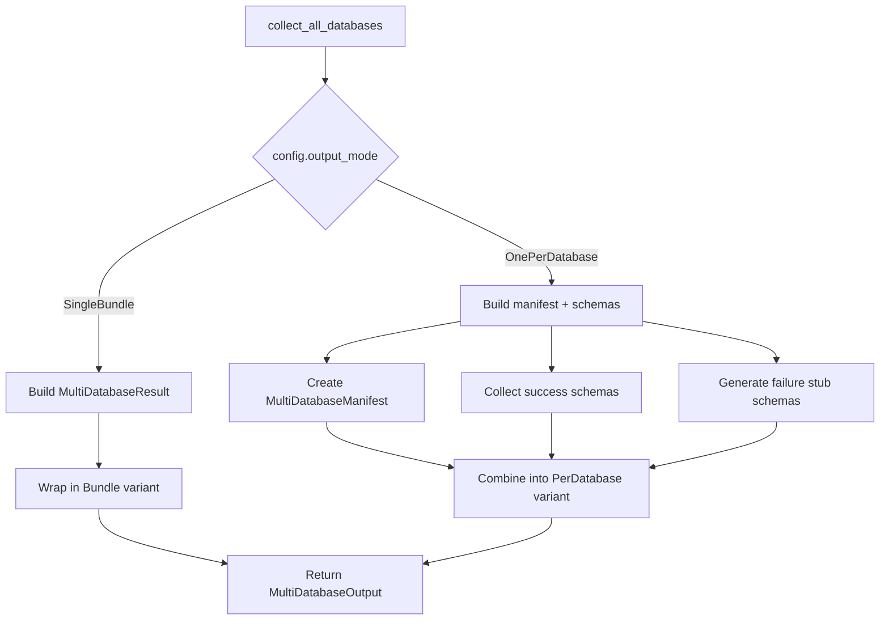

# Update PostgreSQL Multi-Database Orchestrator for New Output Variants

## Overview

Integrate include patterns, output variants, and failure stub generation into PostgreSQL multi-database collection. This completes the multi-database collection feature with all v1.0 requirements.

## Scope

**What's Included**:

- Update `collect_all_databases()` signature in `file:dbsurveyor-core/src/adapters/postgres/multi_database.rs`:
  - Return `MultiDatabaseOutput` instead of `MultiDatabaseResult`
  - Accept `config: &MultiDatabaseConfig` with include patterns and output mode
- Integrate include pattern filtering:
  - Update `filter_databases()` to accept both include and exclude patterns
  - Apply additive include semantics: start empty, add matches, then remove excludes
  - Reuse existing `glob_match()` function
- Build appropriate `MultiDatabaseOutput` variant based on `config.output_mode`:
  - **SingleBundle**: Wrap existing `MultiDatabaseResult` in `Bundle` variant
  - **OnePerDatabase**: Build `PerDatabase` variant with manifest and schemas
- Generate failure stub schemas for failed databases in `PerDatabase` mode:
  - Create `DatabaseSchema` with `database_info.collection_status: CollectionStatus::Failed`
  - Populate `collection_metadata.warnings` with error summary from `DatabaseFailure`
  - Include in `schemas` vector alongside successful schemas
- Update `collect_single_database()` to preserve object failures:
  - Extract `object_failures` from `DatabaseSchema.collection_metadata`
  - Include in final output for both variants
- Update integration tests to verify both output modes:
  - Test single bundle mode (existing behavior)
  - Test one-per-database mode with manifest and per-db files
  - Test failure stub generation when database collection fails
- Add tests for include pattern filtering with real PostgreSQL server

**What's Explicitly Out**:

- CLI serialization logic (handled in `ticket:de2eeeb8-bfeb-4a11-98aa-84efc70568b2/4`)
- Manifest file format definition (handled in `ticket:de2eeeb8-bfeb-4a11-98aa-84efc70568b2/4`)
- MySQL/SQLite multi-database support (future work)

## Multi-Database Output Variants

## Acceptance Criteria

- [ ] `collect_all_databases()` returns `MultiDatabaseOutput` enum
- [ ] Include patterns correctly filter databases (additive semantics: start empty, add matches)
- [ ] Include + exclude patterns work together (include first, then exclude)
- [ ] Bundle variant wraps existing `MultiDatabaseResult` (backward compatible)
- [ ] PerDatabase variant includes manifest with database list and status
- [ ] Failure stub schemas are generated for failed databases with:
  - `collection_status: CollectionStatus::Failed`
  - `collection_metadata.warnings` containing error summary
  - Empty tables/views/indexes/constraints arrays
- [ ] Object failures from partial collections are preserved in output (both variants)
- [ ] Integration tests verify both output modes with real PostgreSQL server (10+ databases)
- [ ] Integration test verifies failure stub generation when database collection fails (permission error)
- [ ] Integration test verifies include pattern filtering with various glob patterns

## References

- **Spec**: `spec:de2eeeb8-bfeb-4a11-98aa-84efc70568b2/820ca524-8c7d-4939-8097-f1158e7d67ea` (Tech Plan - Multi-Database Orchestrator Extensions)
- **Core Flows**: `spec:de2eeeb8-bfeb-4a11-98aa-84efc70568b2/661dbe3d-b679-4287-991e-26f4a0dd98b9` (Flow 2 - single bundle default with opt-in)
